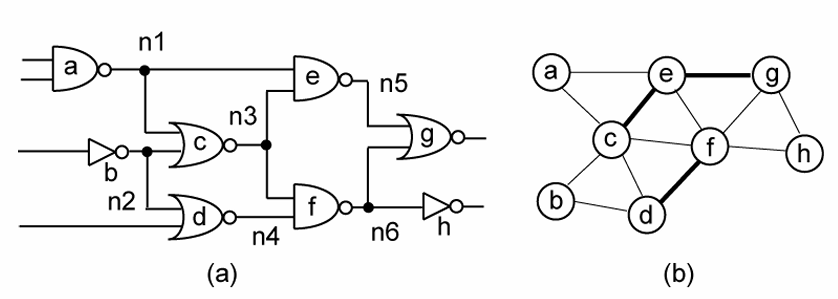
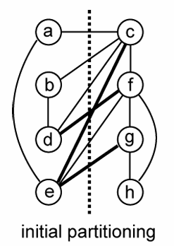
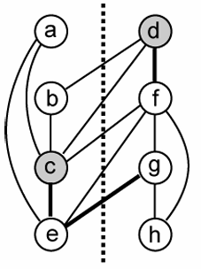
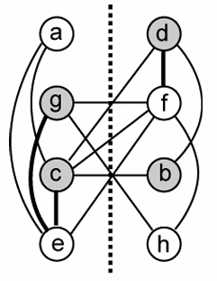
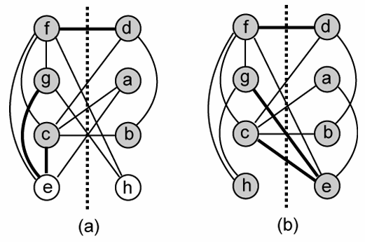

# Kernighan-Lin Algorithm

- It is a **biosectioning** algorithm
    - The input graph is partitioned into two subsets of equal sizes.

- Till the cutsize keeps improving
    - Vertex pairs which give the **largest decrease in cutsize** are exchanged.
    - These vertices are then **locked**
    - If no improvement is possible and some vertices are still unlocked, the vertices which give the smallest increase are exchanged.

- Kernighan-Lin Algorithm  
    - The formula of `gain`: 
        $$
        \boldsymbol{D(x, y) = g(x, y) = E_x - I_x + E_y - I_y - 2c(x, y)}
        $$
        , where $\boldsymbol{E_x}$ **is the # of extended neighbors of x**,  
        $\boldsymbol{I_x}$ **is the # of interior neighbors of x**,   
        and $\boldsymbol{c(x, y)}$ **is the # of mutual connected lines between x and y** 

    - **Algorithm KL**
    ```pesudocode
    begin
        INITIALIZE()
        while (IMPROVE(table) == TRUE) do (if and improvement has been made during last iteration, the process is carried out again.)
            while (UNLOCK(A) == TRUE) do (if there exists any unlocked vertex in A, more tentaive exchanges are carried out.)
                for (each a in A) do
                    if (a == unlocked) then
                        for (each b in B) then
                            if (b == unlocked) then
                                if (D_max < D(a) + D(b)) then
                                    D_max = D(a) + D(b)
                                    a_max = a
                                    b_max = b
                TENT-EXCHANGE(a_max, b_max)
                LOCK(a_max, b_max);
                LOG(table)
                D_max = negative infinite
            ACTUAL-EXCHANGE(table)
    end
    ```

- Example
    - Perform single KL pass on the following circuit:
        - KL needs **undirected graph** (**clique-based** weighting)  
            - *a single line represents a weight of 0.5*
            - *a bold line represents a weight of 1*

        

    - **First Swap (16 potential swaps)**

        

        |   pair    |   $\boldsymbol{E_x - I_x}$    |   $\boldsymbol{E_y - I_y}$    |   $\boldsymbol{c(x,y)}$   |   gain    |
        |-----------|-------------------------------|-------------------------------|---------------------------|-----------|
        |   (a, c)  |   0.5 - 0.5                   |    2.5 - 0.5                  |   0.5                     |   1       |
        |   (a, f)  |   0.5 - 0.5                   |    1.5 - 1.5                  |   0                       |   0       |
        |   (a, g)  |   0.5 - 0.5                   |    1 - 1                      |   0                       |   0       |
        |   (a, h)  |   0.5 - 0.5                   |    0 - 1                      |   0                       |   -1      |
        |   (b, c)  |   0.5 - 0.5                   |    2.5 - 0.5                  |   0.5                     |   1       |
        |   (b, f)  |   0.5 - 0.5                   |    1.5 - 1.5                  |   0                       |   0       |
        |   (b, g)  |   0.5 - 0.5                   |    1 - 1                      |   0                       |   0       |
        |   (b, h)  |   0.5 - 0.5                   |    0 - 1                      |   0                       |   -1      |
        |   **(d, c)**  |   **1.5 - 0.5**                   |   **2.5 - 0.5**                  |   **0.5**                     |   **2**       |
        |   (d, f)  |   1.5 - 0.5                   |    1.5 - 1.5                  |   1                       |   -1      |
        |   (d, g)  |   1.5 - 0.5                   |    1 - 1                      |   0                       |   1       |
        |   (d, h)  |   1.5 - 0.5                   |    0 - 1                      |   0                       |   0       |
        |   **(e, c)**  |   **2.5 - 0.5**                   |    **2.5 - 0.5**                  |   **1**                       |   **2**       |
        |   (e, f)  |   2.5 - 0.5                   |    1.5 - 1.5                  |   0.5                     |   1       |
        |   (e, g)  |   2.5 - 0.5                   |    1 - 1                      |   1                       |   0       |
        |   (e, h)  |   2.5 - 0.5                   |    0 - 1                      |   0                       |   1       |


        Select **(d,c)** pair as next swap

    - **Second Swap (9 potential swaps)**

        
   
        |   pair    |   $\boldsymbol{E_x - I_x}$    |   $\boldsymbol{E_y - I_y}$    |   $\boldsymbol{c(x,y)}$   |   gain    |
        |-----------|-------------------------------|-------------------------------|---------------------------|-----------|
        |   (a, f)  |   0 - 1                       |   1 - 2                       |   0                       |   -2      |
        |   (a, g)  |   0 - 1                       |   1 - 1                       |   0                       |   -1      |
        |   (a, h)  |   0 - 1                       |   0 - 1                       |   0                       |   -2      |
        |   (b, f)  |   0.5 - 0.5                   |   1 - 2                       |   0                       |   -1      |
        | **(b, g)** | **0.5 - 0.5** | **1 - 1** | **0**     | **0** |
        | (b, h)    |   0.5 - 0.5                   |   0 - 1                       |   0                       |   -1      |
        | (e, f)    |   1.5 - 1.5                   |   1 - 2                       |   0.5                     |   -2      |
        | (e, g)    |   1.5 - 1.5                   |   1 - 1                       |   1                       |   -2      |
        | (e, h)    |   1.5 - 1.5                   |   0 - 1                       |   0                       |   -1      |

        Select **(b, g)** pair as next swap

    - **Third Swap (4 potential swaps)**

        

        |   pair    |   $\boldsymbol{E_x - I_x}$    |   $\boldsymbol{E_y - I_y}$    |   $\boldsymbol{c(x,y)}$   |   gain    |
        |-----------|-------------------------------|-------------------------------|---------------------------|-----------|
        | **(a, f)** | **0 - 1**                    | **1.5 - 1.5**                 |   **0**                   |   **-1**  |
        | (a, h)    |   0 - 1                       |   0.5 - 0.5                   |   0                       |   -1      |
        | (e, f)    |   0.5 - 2.5                   |   1.5 - 1.5                   |   0.5                     |   -3      |
        | (e, h)    |   0.5 - 2.5                   |   0.5 - 0.5                   |   0                       |   -2      |

    Select **(a, f)** pair as next swap

    - **Fourth Swap (The last swap)**

        |   pair    |   $\boldsymbol{E_x - I_x}$    |   $\boldsymbol{E_y - I_y}$    |   $\boldsymbol{c(x,y)}$   |   gain    |
        |-----------|-------------------------------|-------------------------------|---------------------------|-----------|
        |   (e, h)  |   0.5 - 2.5                   |   1 - 0                       |   0                       |   -1      |

    - The last swap always executes.

        

    - Summary
        - **Cutsize Reduced from 5 to 3**
        - Two best solutions found (solutions are always **area-balanced**)
        - Cutsize: Take look at those images
            - The original Cutsize, look at the image of initial partitioning, and you can found 0.5 + 0.5 + 0.5 + 1 + 1 + 0.5 + 1 = 5 edges
            - Cutsize of 1st iteration looks at the second swap's image, and you can found it cuts 0.5 + 0.5 + 0.5 + 0.5 + 1 = 3 edges
            - Cutsize of 2 iteration looks at the third swap's image, and you can found it cuts 0.5 + 0.5 + 0.5 + 0.5 + 0.5 + 0.5 = 3 edges
            - Cutsize of 3 iteration looks at the last swap's (a), and you can found it cuts 1 + 0.5 + 0.5 + 0.5 + 0.5 + 0.5 + 0.5 = 4 edges
            - Custize of 4 iteration looks at the last swap's (b), and you can found it cuts 1 + 0.5 + 1 + 0.5 + 0.5 + 0.5 + 1 = 5 edges
        - $\Sigma gain(i) = Cutsize_0 - Cutsize_i$ 
        - gain(i) is the select pair's gain.


        | $\boldsymbol{i}$   |  pair     |  gain(i)   | $\Sigma$ gain(i)   | Cutsize |
        |--------------------|-----------|------------|--------------------|---------|
        |   0                | -         | -          | -                  | 5       |
        |   **1**            | **(d, c)** | **2**     | **2**              | **3**   |
        |   **2**            | **(b, g)** | **0**     | **2**              | **3**   |
        |   3                | (a, f)    | -1         | 1                  | 4       |
        |   4                | (e, h)    | -1         | 0                  | 5       |

    
    
    
    
    
    
    
    
    
    
