# Kernighan-Lin Algorithm

- It is a **biosectioning** algorithm
    - The input graph is partitioned into two subsets of equal sizes.

- Till the cutsize keeps improving
    - Vertex pairs which give the **largest decrease in cutsize** are exchanged.
    - These vertices are then **locked**
    - If no improvement is possible and some vertices are still unlocked, the vertices which give the smallest increase are exchanged.

- Kernighan-Lin Algorithm  
    - The formula of `gain`: 

        $$D(x, y) = g(x, y) = E_x - I_x + E_y - I_y - 2c(x, y)$$

        , where $E_x$ **is the # of extended neighbors of x**,  
        $I_x$ **is the # of interior neighbors of x**,   
        and $c(x, y)$ **is the # of mutual connected lines between x and y** 

    - **Algorithm KL**
    ```pesudocode
    begin
        INITIALIZE()
        while (IMPROVE(table) == TRUE) do (if and improvement has been made during last iteration, the process is carried out again.)
            while (UNLOCK(A) == TRUE) do (if there exists any unlocked vertex in A, more tentaive exchanges are carried out.)
                for (each a in A) do
                    if (a == unlocked) then
                        for (each b in B) then
                            if (b == unlocked) then
                                if (D_max < D(a) + D(b)) then
                                    D_max = D(a) + D(b)
                                    a_max = a
                                    b_max = b
                TENT-EXCHANGE(a_max, b_max)
                LOCK(a_max, b_max);
                LOG(table)
                D_max = negative infinite
            ACTUAL-EXCHANGE(table)
    end
    ```

- Example
    - Perform single KL pass on the following circuit:
        - KL needs **undirected graph** (**clique-based** weighting)  
            - *a single line represents a weight of 0.5*
            - *a bold line represents a weight of 1*

        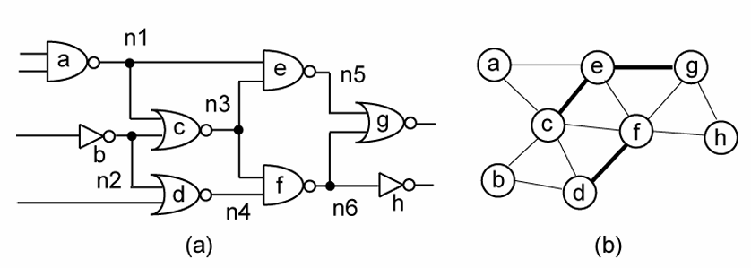

    - **First Swap (16 potential swaps)**

        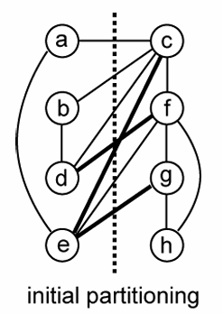

        |   pair    |   $\boldsymbol{E_x - I_x}$    |   $\boldsymbol{E_y - I_y}$    |   $\boldsymbol{c(x,y)}$   |   gain    |
        |-----------|-------------------------------|-------------------------------|---------------------------|-----------|
        |   (a, c)  |   0.5 - 0.5                   |    2.5 - 0.5                  |   0.5                     |   1       |
        |   (a, f)  |   0.5 - 0.5                   |    1.5 - 1.5                  |   0                       |   0       |
        |   (a, g)  |   0.5 - 0.5                   |    1 - 1                      |   0                       |   0       |
        |   (a, h)  |   0.5 - 0.5                   |    0 - 1                      |   0                       |   -1      |
        |   (b, c)  |   0.5 - 0.5                   |    2.5 - 0.5                  |   0.5                     |   1       |
        |   (b, f)  |   0.5 - 0.5                   |    1.5 - 1.5                  |   0                       |   0       |
        |   (b, g)  |   0.5 - 0.5                   |    1 - 1                      |   0                       |   0       |
        |   (b, h)  |   0.5 - 0.5                   |    0 - 1                      |   0                       |   -1      |
        |   **(d, c)**  |   **1.5 - 0.5**                   |   **2.5 - 0.5**                  |   **0.5**                     |   **2**       |
        |   (d, f)  |   1.5 - 0.5                   |    1.5 - 1.5                  |   1                       |   -1      |
        |   (d, g)  |   1.5 - 0.5                   |    1 - 1                      |   0                       |   1       |
        |   (d, h)  |   1.5 - 0.5                   |    0 - 1                      |   0                       |   0       |
        |   **(e, c)**  |   **2.5 - 0.5**                   |    **2.5 - 0.5**                  |   **1**                       |   **2**       |
        |   (e, f)  |   2.5 - 0.5                   |    1.5 - 1.5                  |   0.5                     |   1       |
        |   (e, g)  |   2.5 - 0.5                   |    1 - 1                      |   1                       |   0       |
        |   (e, h)  |   2.5 - 0.5                   |    0 - 1                      |   0                       |   1       |


        Select **(d,c)** pair as next swap

    - **Second Swap (9 potential swaps)**

        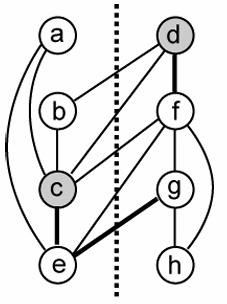
   
        |   pair    |   $\boldsymbol{E_x - I_x}$    |   $\boldsymbol{E_y - I_y}$    |   $\boldsymbol{c(x,y)}$   |   gain    |
        |-----------|-------------------------------|-------------------------------|---------------------------|-----------|
        |   (a, f)  |   0 - 1                       |   1 - 2                       |   0                       |   -2      |
        |   (a, g)  |   0 - 1                       |   1 - 1                       |   0                       |   -1      |
        |   (a, h)  |   0 - 1                       |   0 - 1                       |   0                       |   -2      |
        |   (b, f)  |   0.5 - 0.5                   |   1 - 2                       |   0                       |   -1      |
        | **(b, g)** | **0.5 - 0.5** | **1 - 1** | **0**     | **0** |
        | (b, h)    |   0.5 - 0.5                   |   0 - 1                       |   0                       |   -1      |
        | (e, f)    |   1.5 - 1.5                   |   1 - 2                       |   0.5                     |   -2      |
        | (e, g)    |   1.5 - 1.5                   |   1 - 1                       |   1                       |   -2      |
        | (e, h)    |   1.5 - 1.5                   |   0 - 1                       |   0                       |   -1      |

        Select **(b, g)** pair as next swap

    - **Third Swap (4 potential swaps)**

        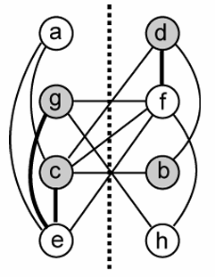

        |   pair    |   $\boldsymbol{E_x - I_x}$    |   $\boldsymbol{E_y - I_y}$    |   $\boldsymbol{c(x,y)}$   |   gain    |
        |-----------|-------------------------------|-------------------------------|---------------------------|-----------|
        | **(a, f)** | **0 - 1**                    | **1.5 - 1.5**                 |   **0**                   |   **-1**  |
        | (a, h)    |   0 - 1                       |   0.5 - 0.5                   |   0                       |   -1      |
        | (e, f)    |   0.5 - 2.5                   |   1.5 - 1.5                   |   0.5                     |   -3      |
        | (e, h)    |   0.5 - 2.5                   |   0.5 - 0.5                   |   0                       |   -2      |

    Select **(a, f)** pair as next swap

    - **Fourth Swap (The last swap)**

        |   pair    |   $\boldsymbol{E_x - I_x}$    |   $\boldsymbol{E_y - I_y}$    |   $\boldsymbol{c(x,y)}$   |   gain    |
        |-----------|-------------------------------|-------------------------------|---------------------------|-----------|
        |   (e, h)  |   0.5 - 2.5                   |   1 - 0                       |   0                       |   -1      |

    - The last swap always executes.

        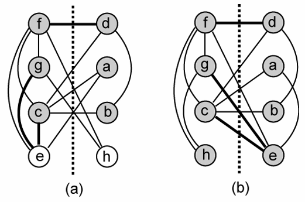

    - Summary
        - **Cutsize Reduced from 5 to 3**
        - Two best solutions found (solutions are always **area-balanced**)
        - Cutsize: Take look at those images
            - The original Cutsize, look at the image of initial partitioning, and you can found 0.5 + 0.5 + 0.5 + 1 + 1 + 0.5 + 1 = 5 edges
            - Cutsize of 1st iteration looks at the second swap's image, and you can found it cuts 0.5 + 0.5 + 0.5 + 0.5 + 1 = 3 edges
            - Cutsize of 2 iteration looks at the third swap's image, and you can found it cuts 0.5 + 0.5 + 0.5 + 0.5 + 0.5 + 0.5 = 3 edges
            - Cutsize of 3 iteration looks at the last swap's (a), and you can found it cuts 1 + 0.5 + 0.5 + 0.5 + 0.5 + 0.5 + 0.5 = 4 edges
            - Custize of 4 iteration looks at the last swap's (b), and you can found it cuts 1 + 0.5 + 1 + 0.5 + 0.5 + 0.5 + 1 = 5 edges
        - $\Sigma gain(i) = Cutsize_0 - Cutsize_i$ 
        - gain(i) is the select pair's gain.


        | $\boldsymbol{i}$   |  pair     |  gain(i)   | $\Sigma$ gain(i)   | Cutsize |
        |--------------------|-----------|------------|--------------------|---------|
        |   0                | -         | -          | -                  | 5       |
        |   **1**            | **(d, c)** | **2**     | **2**              | **3**   |
        |   **2**            | **(b, g)** | **0**     | **2**              | **3**   |
        |   3                | (a, f)    | -1         | 1                  | 4       |
        |   4                | (e, h)    | -1         | 0                  | 5       |

    
- Drawbacks of K-L Algorithm
    - considers balanced partitions only
    - As vertices have unit weights, it is not possible to allocate a vertex to a partition
    - considers edges instead of hyperedges
    - High time complexity $O(n^3)$    
    
    
# Fiduccia-Mattheyses Algorithm

- A modified version of Kernighan-Lin Algorithm

- A single vertex is moved across the cut in a single move which **permits handling of unbalanced partitions**

- The concept of cutsize is extended to **hypergraphs**
    - The updated **gain** :
    
        $$\text{gain(x)} = \text{good hyperedges} - \text{bad hyperedges}$$
    
        , where $\text{good hyperedges}: \text{ total number of hyperedges that contain x as the only gate at the other side}$

        $\text{bad hyperedges}: \text{ total number uncut hyperedges that contain x}$

    - **neighbour**: All gates that are contained in the hypergraphs taht contain x

    - The time complexity of calculating a gain for a given vertice is $O(1)$

    - The time complexity of finding the neighhours for a given vertice is also $O(1)$

- Vertices to be moved are selected in a way (**bucket list**) to improve time complexity
    - **bucket lists (priority queues)**
        - Sort nodes by gain within each partition

    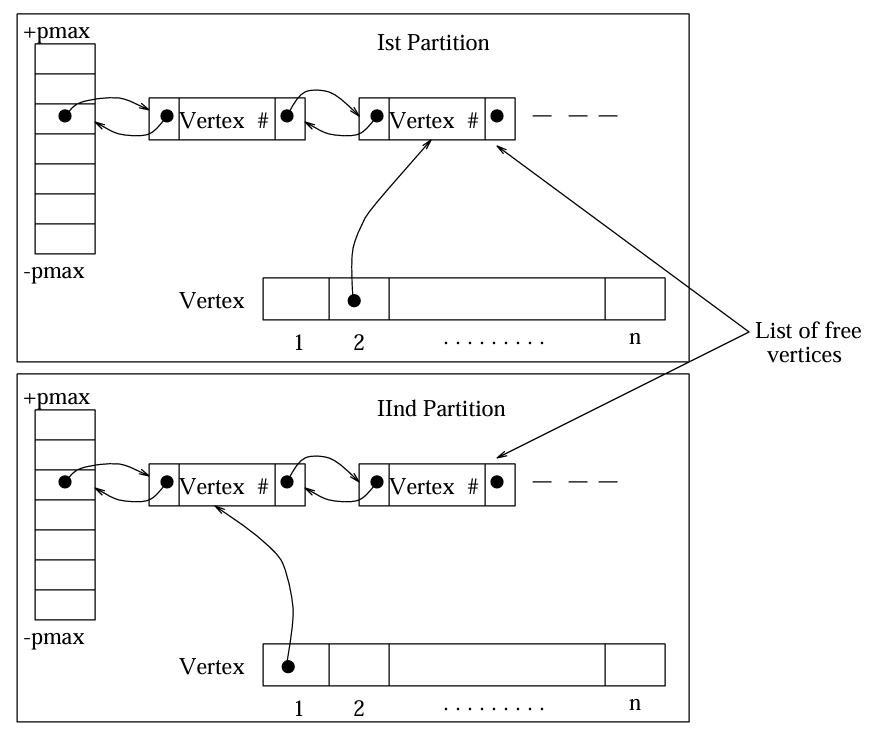

- Overall time complexity of the algorithm is $O(n^2)$

- Pesudocode
    ```
    Input: 
    - G(V, E): Hypergraph with vertices V and hyperedges E
    - P1, P2: Initial partition of V such that |P1| ≈ |P2|
    - Max_imbalance: Allowed imbalance between partitions

    Output:
    - Improved partition (P1', P2') with minimized edge cut

    Initialize iteration variables:
    - Best_cutsize = Current cutsize
    - Best_move_sequence = []
    - Current_cutsize = Current cutsize
    - Moved_nodes = []
    - create a new bucket list
    - compute gain for each node and put them into bucket list

    Begin
    while there exists unlocked node in the bucket list:
        i. select the highest gain node from non-empty bucket list 
            - ensure the selected node will not exceed allowed imbalance between two partitions
        ii. move the selected node to the other partition
        iii. lock the moved node
        iv. update cutsize and track changes
            - Update Current_cutsize
            - Append move to Moved_nodes
        v. update gain of affected neigbours
            - Recompute gains for adjacent nodes
            - Move them in the bucket list accordingly
        vi. if Current_cutsize < Best_cutsize:
            - Store `Best_cutsize`
            - Store `Best_move_sequence`
    End
    ```

- Example
    - Perform FM algorithm on the following circuit:
        - Area constraint = [3, 5]
            - The maximum imbalance between two sides cannot exceed 2

        - Break ties in alphabetical order

        - Example circuit and the hypergraphs

        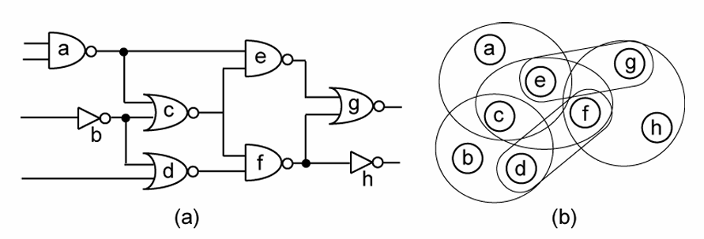
    
    - Random initial partioning is gaiven
        - {a, c, d, g} and {b, e, f, h}

        - Six hyperedges
            - n1: (a, c, e)
            - n2: (b, c, d)
            - n3: (c, f, e)
            - n4: (g, f, h)
            - n5: (d, f)
            - n6: (g, e)

        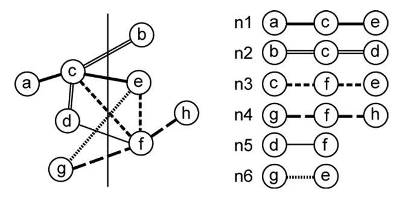

    - **Initial Bucket**
        
        |  Vertice     |  good hyperedge     |   bad hyperedge    |   gain    |
        |--------------|---------------------|--------------------|-----------|
        |   a          |    0                |     0              |   0       |
        |   b          |    1                |     0              |   1       |
        |   c          |    1                |     0              |   1       |
        |   d          |    1                |     0              |   1       |
        |   **e**      |    **2**            |     **0**          |   **2**   |
        |   f          |    1                |     0              |   1       |
        |   **g**      |    **2**            |     **0**          |   **2**   |
        |   h          |    0                |      0             |   0       |

        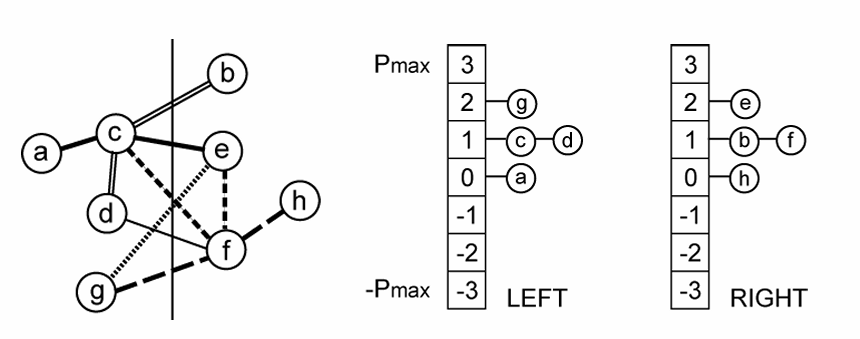

        - Cutsize: 6

    - **First Move**
        - both cell *e* and *g* have the maximum gain and can be **moved without violating the area constraint**
        
        - Move **e** based on alphabetical order

        - Lock cell **e**
        
        - The neighbour of e is {a, c, f, g}

        - Update the neighbour of c and get the updated bucket list

        |  Vertice     |   good hyperedge    |  bad hyperedge     |   gain   |
        |--------------|---------------------|--------------------|----------|
        |  *a*         |   *0*               |  *1*               |   *-1*   |
        |   b          |    1                |  0                 |   1      |
        |  *c*         |   *0*               |  *1*               |   *-1*   |
        |   d          |    1                |  0                 |   1      |
        |  ***f***     |   ***2***           |  ***0***           |   ***2***|
        |  *g*         |   *1*               |  *1*               |   *0*    |
        |   h          |    0                |   0                |   0      |

        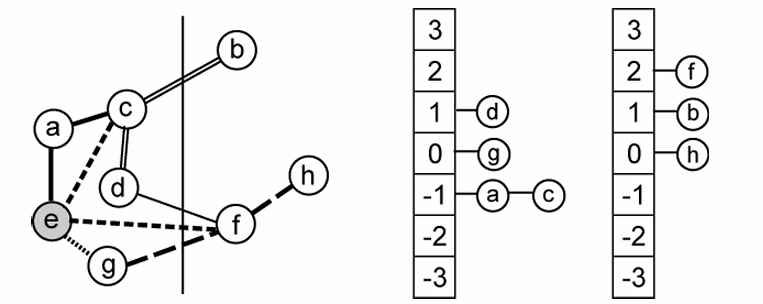

        - Cutsize: 4

    - **Second Move**
        - cell *f* has the maximum gain but **move it will lead imbalance to exceed the area constraint**
        
        - Move **d** because it has the second maximum gain

        - Lock cell **d**

        - The neighbour of d is {b, c, f}

        - Update the neighbour of d and get the updated bucket list

        |  Vertice     |   good hyperedge    |  bad hyperedge     |   gain   |
        |--------------|---------------------|--------------------|----------|
        |  a           |   0                 |  1                 |   -1     |
        |   ***b***    |    ***0***          |  ***0***           |   ***0***|
        |   ***c***    |    ***1***          |  ***1***           |   ***0***|
        |   ***f***    |    ***1***          |  ***1***           |   ***0***|
        |  **g**       |   **1**             |  **1**             |   **0**  |
        |  **h**       |   **0**             |  **0**             |   **0**  |

        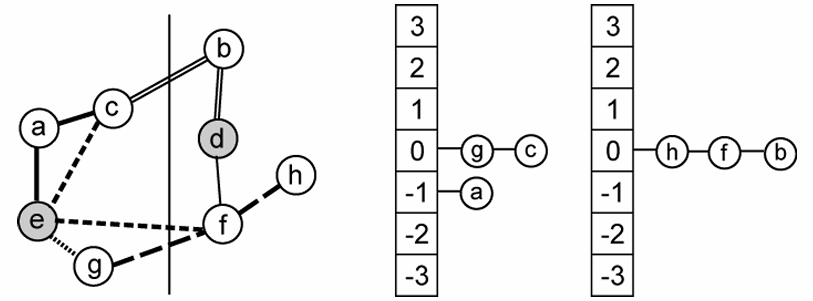

        - Cutsize: 3

    - **Third Move**
        - cell *b*, *c*, *f*, *g*, *h* have the maximum gain

        - Move **b** as **move it without violating the area constraint** and on the alphabetical order

        - Lock cell **b**

        - The neighbour of b is {c} (cell d has been locked)

        - Update the neighbor of b and get the updated bucket list 

        |  Vertice     |   good hyperedge    |  bad hyperedge     |   gain   |
        |--------------|---------------------|--------------------|----------|
        |  a           |   0                 |  1                 |   -1     |
        |   *c*        |    *0*              |  *1*               |   *-1*   |
        |  **f**       |   **1**             |  **1**             |   **0**  |
        |  **g**       |   **1**             |  **1**             |   **0**  |
        |  **h**       |   **0**             |  **0**             |   **0**  |

        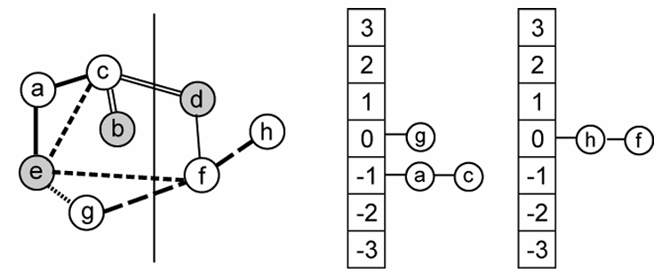

        - Cutsize: 3

    - **Forth Move**
        - cell *f*, *g*, *h* have the maximum gain

        - Move **g** as **move it withut violating the area constraint** and on the alphabetical order

        - Lock cell **g**

        - The neighbour of g is {f, h} (cell e has been locked)

        - Update the neighbor of g and get the updated bucket list

        |  Vertice     |   good hyperedge    |  bad hyperedge     |   gain   |
        |--------------|---------------------|--------------------|----------|
        |  ***a***     |   ***0***           |  ***1***           |  ***-1***|
        |  ***c***     |   ***0***           |  ***1***           |  ***-1***|
        |  ***f***     |   ***1***           |  ***2***           |  ***-1***|
        |  ***h***     |   ***0***           |  ***1***           |  ***-1***|

        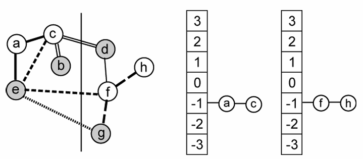

        - Cutsize: 3

    - **Fifth Move**
        - cell *a*, *c*, *f*, *h* have the maximum gain

        - Move **a** on the alphabetical order

        - Lock cell **a**

        - The neighbour of a is {c} (cell e has been locked)

        - Update the neigbour of a and get the updated bucket list

        |  Vertice     |   good hyperedge    |  bad hyperedge     |   gain   |
        |--------------|---------------------|--------------------|----------|
        |  ***c***     |   ***0***           |  ***0***           |  ***0*** |
        |  f           |   1                 |  2                 |  -1      |
        |  h           |   0                 |  1                 |  -1      |

        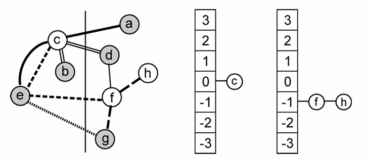

        - Cutsize: 4

    - **Sixth Move**
        - cell *c* has the maxiumum gain but **moving c will violates the area constraint**

        - Move **f** on the alphabetical order

        - Lock cell **f**

        - The neighbour of f is {c, h} (cell c, d and g have been locked)

        - Update the neighbour of f and get the updated bucket list

        |  Vertice     |   good hyperedge    |  bad hyperedge     |   gain   |
        |--------------|---------------------|--------------------|----------|
        |  *c*         |   *0*               |  *1*               |  *-1*    |
        |  ***h***     |   ***0***           |  ***0***           |  ***0*** |

        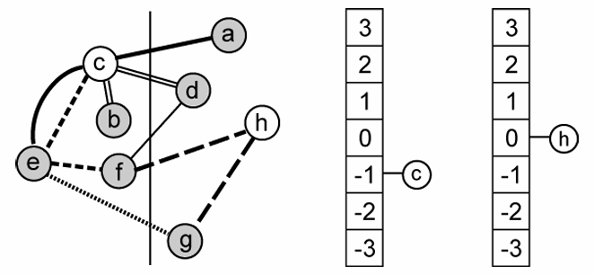

        - Cutsize: 5

    - **Seventh Move**
        - cell *h* has the maximum gain and move without violating the area constraint

        - Move **h**

        - Lock cell **h**

        - **h has no neigbhour** and the bucket list will be

        |  Vertice     |   good hyperedge    |  bad hyperedge     |   gain   |
        |--------------|---------------------|--------------------|----------|
        |  c           |   0                 |  1                 |  -1      |
        
        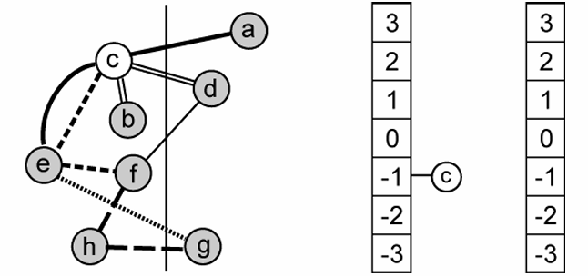

        - Cutsize: 5

    - **Last Move**
        - can only move cell **c**

        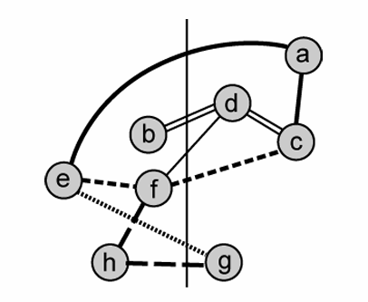

        - Custzie: 6

    - **Summary**
        - Found three best solutions

        - Solutions after moving 2 and 4 are better balanced

        |   i   |   cell    |   g(i)    |   $\sum g(i)$ |   cutsize |
        |-------|-----------|-----------|---------------|-----------|
        |   0   |   -       |   -       |   -           |   6       |
        |   1   |   e       |   2       |   2           |   4       |
        | **2** |   **d**   |   **1**   |   **3**       |   **3**   |
        | **3** |   **b**   |   **0**   |   **3**       |   **3**   |
        | **4** |   **g**   |   **0**   |   **3**       |   **3**   |
        |   5   |   a       |   -1      |   2           |   4       |
        |   6   |   f       |   -1      |   1           |   5       |
        |   7   |   h       |   0       |   1           |   5       |
        |   8   |   c       |   -1      |   0           |   6       |

        - when i = 2 and i = 4, the two sides both have 4 cells, while i = 3, one side has 3 cells and another side has 5 cells.
            - {a, c, e, g} and {b, d, f, h}, {a, b, c, e} and {d, f, h, g} are more balanced than {a, b, c, e, g} and {f, g, h}


# Polish Expression

Partitioning leads to 

- Blocks with well-defined **areas and shapes** (it may also need *clustering* to combine several partitions into one single partition.)

- Blocks with approximated areas and no particular shapes (flexible blocks)

- A **netlist** specifying connections between the blocks.

Floorplanning, Placement, and Pin Assignment

- Find **locations** for all blocks

- Consider shapes of flexible block, pin locations of all the blocks.

- Three steps in the physical design for VLSI systems 
    - Partitioning
    - Floorplanning
    - Routing

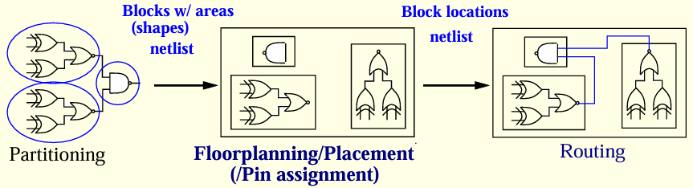

Floor planning

- Inputs to the floorplanning problem:
    - A set of blocks, fixed or flexible
    - Pin locations of fixed blocks
    - A netlist

- Objective: 
    - **Minimize Area**
    - **Reduce wirelength** for (critical) nets
    - **Maximize routability**
    - determine shapes of flexible blocks

Some terminologies for Floorplan Design

- Modules: a shape of rectangle with a width of x and a height of y.

- Aread: the area of the module, i.e, xy

- Aspect ratio: the allowed minimum and maximum value of height and weight ratio (r <= y/x <= s>)

- Rotation: the rotated module with a width of y and a height of x

- Module connectivity: the distances between the centers of modules

- **Rectangular dissection**: subdivison of a given rectangle by a finite number of horizontal and vertical line segments into a finite number of non-overlapping rectangles.

- **Slicing struture**: a rectangular dissection that can be obtained by repetitively subdividing rectangles horizontally or vertically.

- **Slicing tree**: A binary tree, where each internal node represents a vertical cut line or horizontal cut line, and each leaf a basic rectangle.

- **Skewed Slicing tree**: One in which and its **right** child are the same.

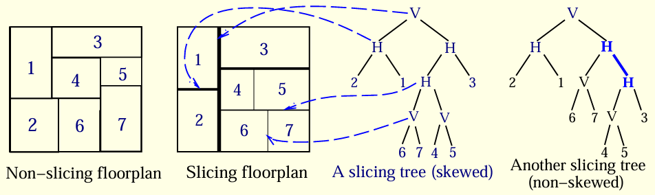

- A good structure should be a **slicing floorplan** and **skewed slicing tree**

## Polish Expression Representation

An expression $E = e_1e_2...e_{2n-1}$ where $e_i \in {1, 2, ..., n, H, V}$, $1 \le i \le 2n-1$, is a Polish expression of length of 2n - 1 iff:

**1. every operand j**, $1 \le j \le n$, **appears exactly once in E.** 

**2. The balloting property**:

For every subexpression $E_i = e_1...e_i, 1 \le i \le 2n-1$, $$\text{number of operands} > \text{number of operators}$$

|                   |   1   |   6   |   H   |   3   |   5   |   V   |   2   |   H   |   V   |   7   |   4   |   H   |   V   |
|-------------------|-------|-------|-------|-------|-------|-------|-------|-------|-------|-------|-------|-------|-------|
|number of operands |   1   |   2   |   2   |   3   |   4   |   4   |   5   |   5   |   5   |   6   |   7   |   7   |   7   |
|number of operators|   0   |   0   |   1   |   1   |   1   |   2   |   2   |   3   |   4   |   4   |   4   |   5   |   6   |

- Polish expression: acutally is a **Postorder Traversal**

- Define: 
    - *ijH*: module $i$ on bottom of $j$.
    ```
        H              module j
       / \      ->    -----------
      i   j            module i
    ```
    - *ijV*: module $i$ on left of $j$.
     ```
        V              
       / \      ->     module i | module j
      i   j            
    ```

- exmaple:


- Some tips for creating skewed tree from slicing footplan:

    - Slice vertically first the slice horizontally if two operators are equivalent

    - For continous horizontal slicing, slicing from bottom to up.

    - For continous vertical slicing, slicing from left to right.

    - Once happen non-skewed tree in the represnetation, use right-branch rotation method:
        
        i.  the right leaf of the original lower right leaf become the original lower right node.

        ii. the left leaf of the original lower right become the original lower right node's right leaf
        
        iii. the left leaf of original upper node becomes the left leaf of original lower right node
        
        iv. the original lower right node becomes left node of original upper node.

        ```
                      V                                             V
                   /     \                                      /       \
                  H        H                                   H         H
                 / \     /   \                                / \      /   \
                2   1   V     H             ->               2   1    H      3
                       / \   / \                                    /   \
                      6   7 V   3                                  V     V   
                           / \                                    / \   / \
                          4   5                                  6   7 4   5
        ```

## Normalized Polish Expression

A Polish expression $E = e_1e_2...e_{2n-1}$ is called normalized iff **E has no consecutive operators of the same type (H or V)**.

Theory: Given a **normalized** Polish expression, we can construct a unique rectangular angular slicing three.

- examole:

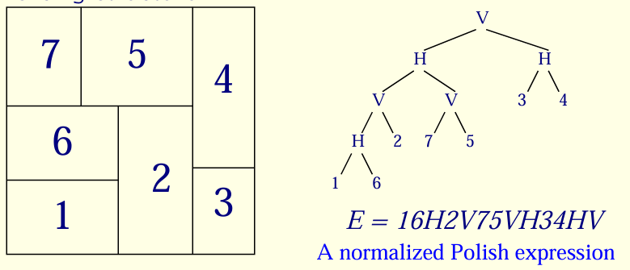

## Three types Moves of Polish Expression

|Pollsion Expression|   1   |   6   |   H   |   3   |   5   |   V   |   2   |   H   |   V   |   7   |   4   |   H   |   V   |
|-------------------|-------|-------|-------|-------|-------|-------|-------|-------|-------|-------|-------|-------|-------|
|number of operands |   1   |   2   |   2   |   3   |   4   |   4   |   5   |   5   |   5   |   6   |   7   |   7   |   7   |
|number of operators|   0   |   0   |   1   |   1   |   1   |   2   |   2   |   3   |   4   |   4   |   4   |   5   |   6   |

- **Chain**
    - HVHVH... or
    - VHVHV...
    - The third and forth chain is a *HV* two-operator chain while the first and second chain is a one-operator chain.

- **Adjacent**
    - 1 and 6 are adjacent operands
    - 2 and 7 are adjacent operands as well
    - 5 and V are adjacent operand and operator

### M1 (Opreand Swap):
Swap two **adjacent oprands**

### M2 (Chain Invert): 

Complement some **chains** ($\overline{V} = H, \overline{H} = V$).

### M3 (Operator/Operand Swap): 

Swap **two adjacent operand and operator**.

- Pay attention to M3 movement: it may cause illegal normalzide Polish Expression.

- **Gold thrumb rule**: Move operands to the left is always valid, but move operators to the left may not be valid, need M3 checks.

- **Check M3 Moves:**  Assume that the M3 move swaps the operand $e_i$ with the operator $e_{i+1}$, $1 \le i \le k - 1$. Then, the swap will not violate the balloting property iff $$2N_{i+1} < i$$.

    - $N_k$: # of operands in the Polish expression $E = e_1e_2...e_k$, $1 \le k \le 2n - 1$

    - For example (see the table): 

        - swap 2 and H: the index of 2 is *7* and the index of H is *8*, the number of opreands at *index 7* is **5** and the number of operators at *index 8* is **3**, (i.e, $N_8 = 3$) and $2*N_8 < 7$, so this move is valid.

        - swap 6 and H: the index of 6 is *2* and the number of operators of H is **1** (i.e, $N_3 = 1$), and $2*N_3 = 2$, so this move is invalid.

    - In addition, if the move oprand and move operator is at index i and i + 1, and the operator at index i - 1 shouldn't be same with operator i + 1.

    - For example, the Polish Expression is 16H35V2VH74HV. The move of operand and operator at index 7 and index 8 is not allowed. (2V)

## Example of construction floorplan from a given normalized Polish Expression

### Initial normalized Polish Expression

PE1 = 25V1H374VH6V8VH

Dimensions: (2,4), (1,3), (3,3), (3,5), (3,2), (5,3), (1,2), (2,4)

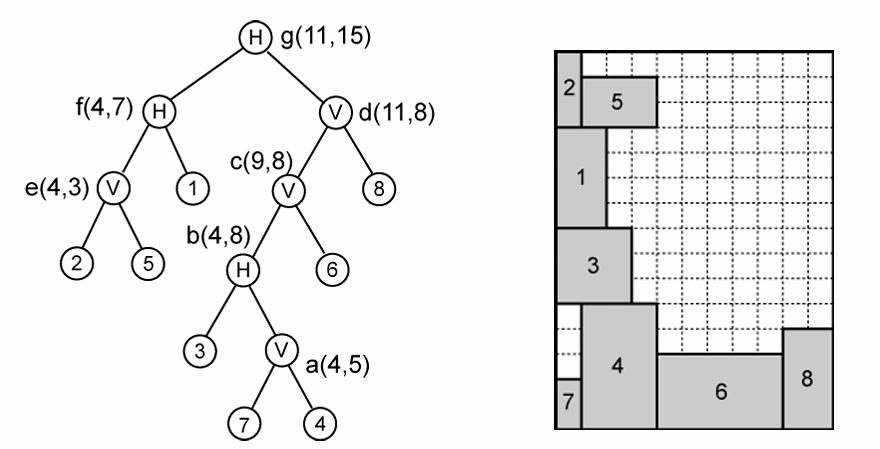

### M1 Move

Swap module 3 and 7 in PE1 and get PE2 = 25V1H734VH6V8VH

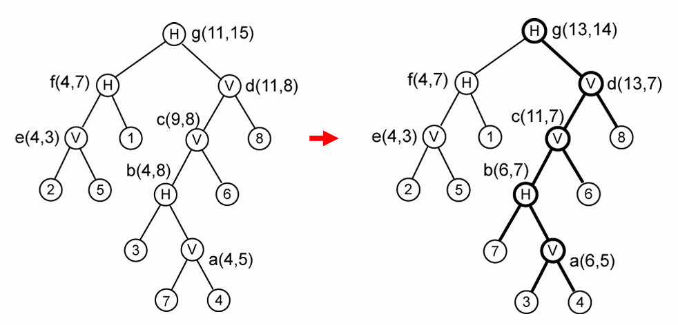

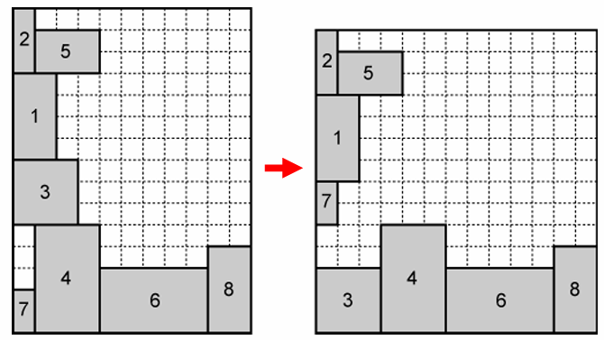

### M2 Move

Complement last chain in PE2 will get PE3 = 25V1H734VH6V8HV

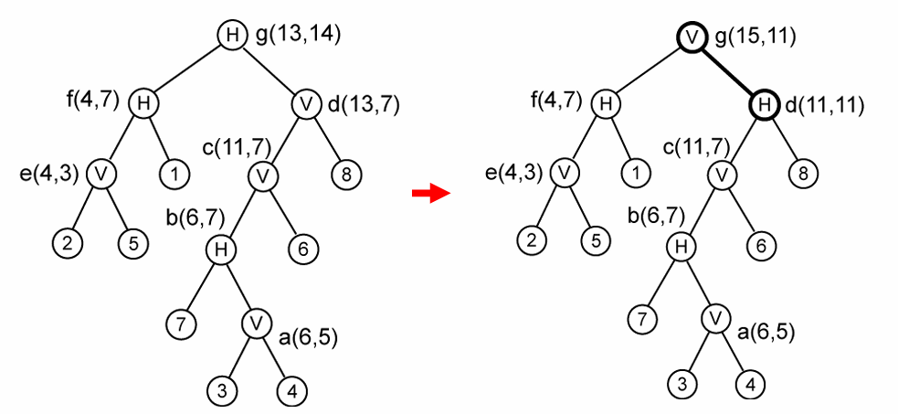

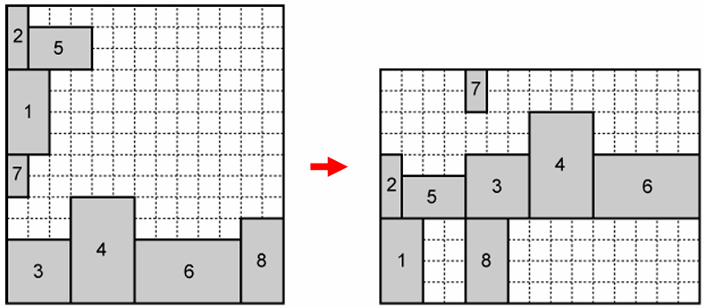

### M3 Move

Swaps 6 and V in PE3 will get PE4 = 25V1H734VHV68HV

- In PE3, the index of 6 is *11* and the number of operator of V is **5** ($N_12 = 5$)

- The swaps 6 and V are valid because $2N_12 = 10 < 11$, so swap of 6 and V is valid.

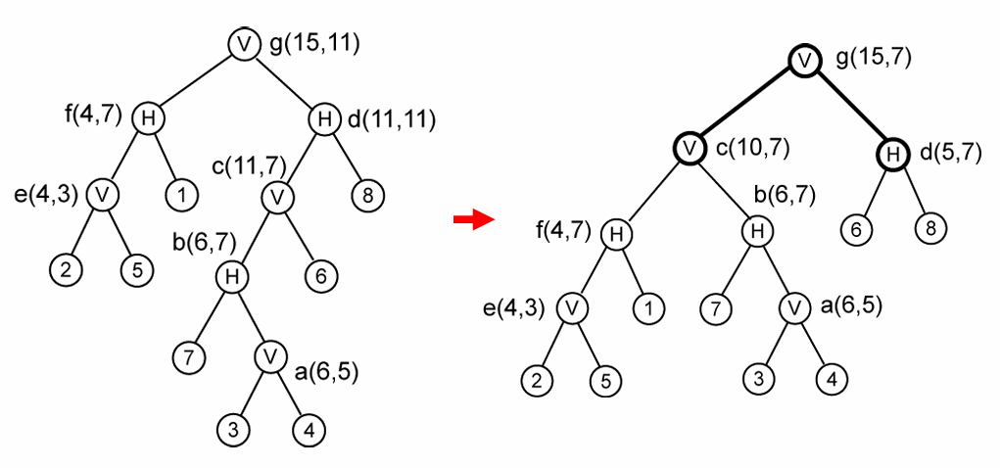

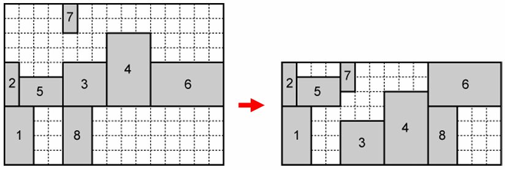


## Area Computation

- **abH**
    - $A = max(\text{width of a}, \text{width of b}) \times (\text{height of a} + \text{height of b})$

    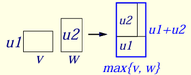

- **abV**
    - $A = (\text{width of a} + \text{width of b}) \times max(\text{height of a} + \text{height of b})$

    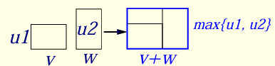

## Over wiring length Computation

The overall wiring length is:

$$W = \sum_{ij} c_{ij} d_{ij}$$

, where $c_{ij}$ is the number of connections between blocks $i$ and $j$.

$d_{ij}$ is the center-to-center distance between basic rectangles $i$ and $j$.

## Cost Function

The cost function is:

$$\Phi = A + \lambda W$$

, where $\lambda$ is the user-specified parameter.

# Sequence-Pair Based Floorplanning/Placement

Represent a packing by a pair of module-name sequences (e.g., ($abdecf, cbfade$))

Correspond all pairs of the sequences to a P-admissible solution space.

Search in the P-admissible solution space (typically, by simulated annealing).

## Relative Module Positions

A floorplan is a partition of a chip into **rooms**, each containing at most one block.

**Locus**(right-up, left-down, up-left, down-right)

1. Take a non-empty room.

2. Start at *the center of the room*, walk in two alternating directions to hit the sides of rooms.

3. Continue until to reach a corner of the chip.

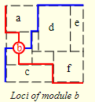

**Positive Locus:**

- Union of **right-up** locus and **left-down** locus.

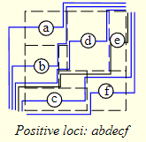

**Negative Locus**

- Union of **up-left** locus and **down-right** locus.

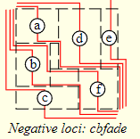

## Geometrical Information

No pair of postive (negative) loci cross each other, i.e, loci are linearly ordered.

Sequence Pair ($Γ_+, Γ_-$): 

- $Γ_+$ is a module-name sequence representing the order of postive loci.

- e.g., $(Γ_+, Γ_-)= (abdecf, cbfade)$

$x'$ is **after** (**before**) $x$ in both $Γ_+$ and $Γ_-$ $⇒$ $x'$ is **right** (**left**) to $x$

$x'$ is **after** (**before**) $x$ in $Γ_+$ and **before**(**after**) $x$ in $Γ_-$ $⇒$ $x'$ is **below** (**above**) to $x$

Object to $x$, when $x'$ 
|$Γ_+$   | $Γ_-$  | Position  |
|--------|--------|-----------|
|after   |  after | right     |
|after   |  before| below     |
|before  |  before| left      |
|beofre  |  after | above     |

## ($Γ_+$, $Γ_-$) Packing 

For every sequence pair ($Γ_+, Γ_-$), there is a ($Γ_+, Γ_-$) packing.

**Horizontal constraint graph** $G_H(V, E)$ (similarly for $G_V(V,E)$)

- V: Source $s$, sink $t$, $m$ vertices for modules.

- E: ($s, x$) and ($x, t$) for each module $x$, and ($x, x'$) iff $x$ must be **left-to** x'.

    - In $G_V(V,E)$, ($x, x'$) iff $x$ must be **down-to** x'.

- **Vertex weight**: 0 for $s$ and $t$, **width** of module **x** for the other vertices.

    - For $G_V(V,E)$, **height** of module **x** for the other vertices.

**Optimal ($Γ_+, Γ_-$) Packing** can be obtained in $O(m^2)$ time by applying a longest path algorithm on a vertex-weighted DAG.

- $G_H$ and $G_V$ are independent

- The $X$ and $Y$ coordinates of each module are determined as the minimun by assiging the longest path length between $s$ and the vertex of the module in $G_H$ and $G_V$, respectively.

The set of all sequence pairs is a P-admissible solution space.


## Transitive Reduction

HCG/VCG are **DAG** （Directed acyclic graph）

**Longest path from the source in terms of # hops**

Then remove the edges not on the longest paths

This can be done in **linear time**! Use **topological sorting**.

## Example

### Initial SP: $SP_1 = (17452638，84725361)$

Dimensions: {1:(2,4), 2:(1,3), 3:(3,3), 4:(3,5), 5:(3,2), 6:(5,3), 7:(1,2), 8:(2,4)} (width, height)

x = 1:
-   |$Γ_+$   | $Γ_-$  | Position  |   x'  |
    |--------|--------|-----------|-------|
    |after   |  after | right     |None   |
    |after   |  before| below     |2345678|
    |before  |  before| left      |None   |
    |beofre  |  after | above     |None   |

x = 2:
-   |$Γ_+$   | $Γ_-$  | Position  |   x'  |
    |--------|--------|-----------|-------|
    |after   |  after | right     |63     |
    |after   |  before| below     |8      |
    |before  |  before| left      |74     |
    |beofre  |  after | above     |15     |

x = 3:
-   |$Γ_+$   | $Γ_-$  | Position  |   x'  |
    |--------|--------|-----------|-------|
    |after   |  after | right     |None   |
    |after   |  before| below     |8      |
    |before  |  before| left      |7452   |
    |beofre  |  after | above     |16     |

x = 4:
-   |$Γ_+$   | $Γ_-$  | Position  |   x'  |
    |--------|--------|-----------|-------|
    |after   |  after | right     |5263   |
    |after   |  before| below     |8      |
    |before  |  before| left      |None   |
    |beofre  |  after | above     |17     |

x = 5:
-   |$Γ_+$   | $Γ_-$  | Position  |   x'  |
    |--------|--------|-----------|-------|
    |after   |  after | right     |63     |
    |after   |  before| below     |28     |
    |before  |  before| left      |74     |
    |beofre  |  after | above     |1      |

x = 6:
-   |$Γ_+$   | $Γ_-$  | Position  |   x'  |
    |--------|--------|-----------|-------|
    |after   |  after | right     |None   |
    |after   |  before| below     |38     |
    |before  |  before| left      |7452   |
    |beofre  |  after | above     |1      |

x = 7:
-   |$Γ_+$   | $Γ_-$  | Position  |   x'  |
    |--------|--------|-----------|-------|
    |after   |  after | right     |5263   |
    |after   |  before| below     |48     |
    |before  |  before| left      |None   |
    |beofre  |  after | above     |1      |

x = 8:
-   |$Γ_+$   | $Γ_-$  | Position  |   x'  |
    |--------|--------|-----------|-------|
    |after   |  after | right     |None   |
    |after   |  before| below     |None   |
    |before  |  before| left      |None   |
    |beofre  |  after | above     |1745263|


Based on $SP_1$ we build the following table:

|module | right-of  | left-of   | above       | below       |
|-------|-----------|-----------|-------------|-------------|
|1      |$\emptyset$|$\emptyset$|$\emptyset$  |2,3,4,5,6,7,8|
|2      |3,6        |   4,7     |   1,5       |   8         |
|3      |$\emptyset$|  2,4,5,7  |   1,6       |   8         |
|4      |2,3,5,6    |$\emptyset$|   1,7       |   8         |
|5      |3,6        |   4,7     |   1         |   2,8       |
|6      |$\emptyset$|   2,4,5,7 |   1         |   3,8       |
|7      |2,3,5,6    |$\emptyset$|   1         |   4,8       |
|8      |$\emptyset$|$\emptyset$|1,2,3,4,5,6,7|$\emptyset$  |

### Constraint Graphs

HCG (Horizontal constaint graph)
- Focus on **right-of** and **left-of** two columns

- 1 and 8 have no right-of and left-of so they are singluar vertices.

- 3 and 6 have left-of but no right-of, so 3 and 6 must be the most right.

- 4 and 7 have right-of but no left-of, so 4 and 6 must be the left most.

- 2 and 5 have both right most vertices 3 and 6 and have left most 4 and 7, so they are in the middle between 4:7, and 3:6.

- 4 and 7 can access 2 and 5 equally, 2 and 5 can access 3 and 6 equally as well. 

- The lines between 4:7 and 3:6 are eliminated as the **transitive reduction**.

Before and after removing transitive edges.
    
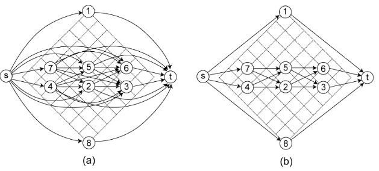

VCG (Vertical constraint graph)

- Foucs on **above** and **below** two columns

- 1 only has below and no above, so 1 is the most top vertice

- 8 only has above and no below, so 8 is the most bottom vertice

- 5, 6, 7 only below the most top vertice 1.

- 2, 3, 4 only above the most bottom vertce 8.

- 5 is above 1, 6 is above 3 and 7 is above 4.

After removing transitive edges.

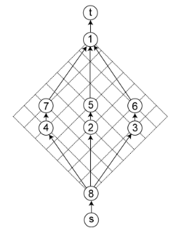

### Computing Chip Width and Height

In the HCG, the **node weight** is the **module width**, while in the VCG, the **node weight** is the **module height**

The **chip weight** is the **longest path from s to t** for both HCG and VCG.

Since we have applied topology sorting and get the removed transitive edge DAG, so the **longest path** is just to **choose the vertice whose node weight is largest in that layer**

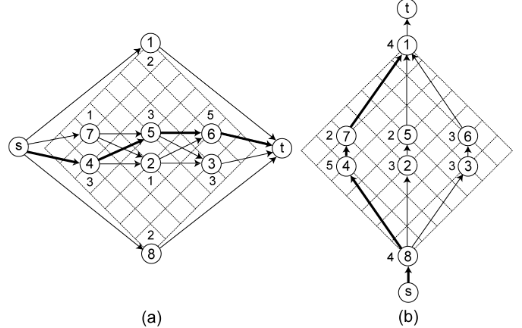

### Computing Module Location

Use longest source-module path length in HCG/VCG

*Lower-left corner location = source to module **input** path length*

In HCG,

- node 1, 7 and 8: not at the longest path, so the weight is the last node connecting to it, i.e, s, so 0.

- node 4: at the longest path, follow its last node's wieght 0.

- node 5: at the longest path, follow its last node's, i.e, 4, weight of 3.

- node 2: not at the longest path, but last node is at the longest path, follows the last node at the longest path, i.e, 4, weight of 3.

- node 6: at the longest path, follow its last node's, i.e, 5, accumulated weight of 6 (3+3).

- node 3: not at the longest path, but last node is at the longest path, follows the last node at the longest path, i.e, 5, accumulated weight of 6 (3+3).


In VCG,

- node 8: at the longest path, follow its last node's wieght 0.

- node 4: at the longest path, follows its last node's weight 4.

- node 2 and 3: not at the longest path, but its last node at the longest path, so follows that node, i.e, 8, weight of 4.

- node 7: at the longest path, follows its last node's, and accumulated weight is 9 (5+4) 

- node 5 and 6: not at the longest path, and their last nodes not at the longest path neither. So they follows their **original path**, and weight is **7 (4+3)**

- node 1: at the longest path, follows its last node's, and accumulated weight is 11 (5+4+2) 

|module |   HCG |   VCG |
|-------|-------|-------|
|1      |   0   |   11  |  
|2      |   3   |   4   |
|3      |   6   |   4   |
|4      |   0   |   4   |
|5      |   3   |   7   |
|6      |   6   |   7   |
|7      |   0   |   9   |
|8      |   0   |   0   |


### The final floorplan

Althogh node 3 and 6 are at the most right (x-axis = 6), the width of 6 is node 5, is larger than the width of node 3, i.e, 3. So the chip width = 6 + 5 = 11

The node 1 is at the most top (y-axis = 11) and its height is 4. So the chip height = 11 + 4 = 15.

Dimension is $11 \times 15$

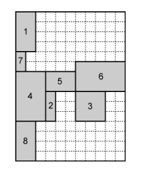

## Move
There are two types of movement:

1. Swap two nodes at the either postive locis or negative locis.

2. Swap two nodes at the both locus.

### Move I

Swap 1 and 3 in positive sequence of SP1

- $SP_1 = (\boldsymbol{1}74526\boldsymbol{3}8, 84725361)$ 

- $SP_2 = (\boldsymbol{3}74526\boldsymbol{1}8, 84725361)$ 

- Node 1 and 3, swicth its below with left-of, above with right-of.

- 6 is special, as it is the node between node 1 and 3 in both $(Γ_+,Γ_-)$, so the move affect it like node 1 and 3

- Excpet 1, 3, and 6, other nodes only replace the original 1 with 3, original 3 with 1.

|module |  right-of (aa)| left-of (bb)  |   above (ba)  |   below (ab)  |
|-------|---------------|---------------|---------------|---------------|
|1      |$\emptyset$    | 2,3,4,5,6,7   |$\emptyset$    |   8           |
|2      |1, 6           | 4, 7          |   3, 5        |   8           |
|3      |1, 6           | $\emptyset$   |$\emptyset$    | 2,4,5,7,8     |
|4      |1,2,5,6        |$\emptyset$    | 3, 7          | 8             |
|5      |1, 6           | 4, 7          |   3           | 2, 8          |
|6      |1              | 2,3,4,5,7     |$\emptyset$    | 8             |
|7      |1,2,5,6        |$\emptyset$    |   3           | 4, 8          |
|8      |$\emptyset$    |$\emptyset$    |1,2,3,4,5,6,7  |$\emptyset$    |

### Constraint Graphs

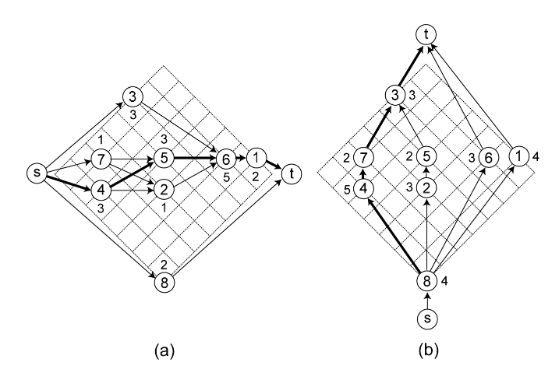


### Constructing Floorplan

- Dimension: $13 \times 14$

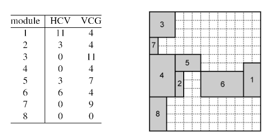

### Move II

Swap 4 and 6 in both sequences of $SP_2$

- $SP_2 = (37\boldsymbol{4}52\boldsymbol{6}18, 8\boldsymbol{4}7253\boldsymbol{6}1)$

- $SP_3 = (37\boldsymbol{6}52\boldsymbol{4}18, 8\boldsymbol{6}7253\boldsymbol{4}1)$

- Move II is relative easier, as only node 4 and 6 switch each other, and other nodes just change original 4 with 6, original 6 with 4.

|module |  right-of (aa)| left-of (bb)  |   above (ba)  |   below (ab)  |
|-------|---------------|---------------|---------------|---------------|
|1      |$\emptyset$    | 2,3,4,5,6,7   |$\emptyset$    |   8           |
|2      |1, 4           | 6, 7          |   3, 5        |   8           |
|3      |1, 4           | $\emptyset$   |$\emptyset$    | 2,5,6,7,8     |
|4      |1              |2,3,5,6,7      |$\emptyset$    | 8             |
|5      |1, 4           | 6, 7          |   3           | 2, 8          |
|6      |1,2,4,5        | $\emptyset$   |   3,7         | 8             |
|7      |1,2,4,5        |$\emptyset$    |   3           | 6, 8          |
|8      |$\emptyset$    |$\emptyset$    |1,2,3,4,5,6,7  |$\emptyset$    |

### Constraint Graphs

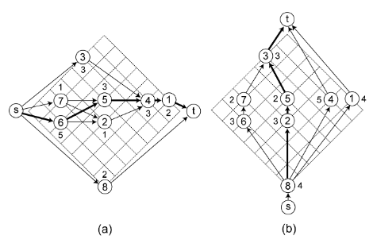

### Constructing Floorplan

- Dimension $13 \times 12$

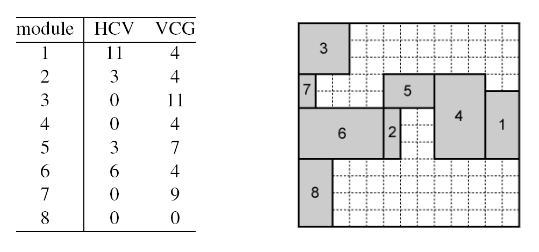

# Min-cut based method for Placement

## Placement Samples

"Standard" cell placement style: all cells have the same height.

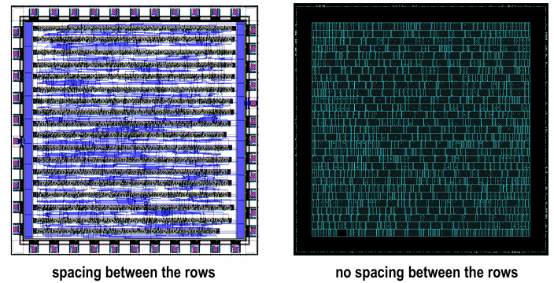

## Placement Objectives:

### Total wirelength

- reducing the total wirelength minimizes power consumption 

- Use **Manhattan distance** to estimate the distance between connected components in the netlist

    - Shorter wirelength leads to lower **RC delay**

    - Reduces routing complexity

    - Helps in achieving better timing closure.
 
### Number of Cut Nets

- Fewer cut nets improve partioning efficiency and reduce interconnect overhead. 

- A "cut net" is a net that spans multiple partition in a **hierarchical** or **partition-based** placement

    - Directly **impacts routing congestion**

    - Reduces interconnect overhead and cross-boundary delays

### Wire Congestion

- Congestion leads to **difficulties in rounting**, **longer routing delays**, and **possible design rule violations** 

- Congestion measures the density of routing demand in a given region compared to available routing resources

    - Affect **timing closure**

    - Help avoid **design rule violations (DRC)**

    - Ensures feasible routing without requiring **detours or layer switching**

### Signal Delay

- Critial for meeting **setup** and **hold time** constraints.

- Placement affects the **RC delay** of interconnects, which influences the **signal propagation delay**

    - Affects **clock period and frequency**

    - Placement should favor **timing-critical paths** and optimize **setup slack**

    - **Buffer insertion** and **cell resizing** may be required post-placement to management delays

## Wirelength Estimation

Perferred method: *Half-perimeter wirelength (HPWL)*

i.e. similar to **Manhattan distance**, $d = |x_1 - x_2| + |y_1 - y_2|$

- Fast (order of magnitude faster than RSMT)

- Equal to length of RSMT for 2- and 3-pi nets

- Margin of error for real circuits approximate 8%

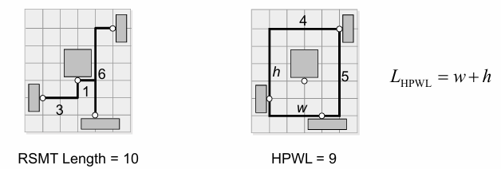

## Min-cut Placement

### Quadrature: suitable for circuits with high density in the center

Divide order:

- horizontal line 1

- vertical line 2

- horizontal line 3a and 3b

- vertical line 4a and 4b

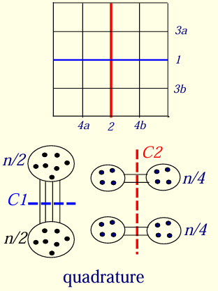

### Bisection: good for standard-cell placement

Bisection order:

- horizontal lines: 1, 2a, 2b, 3a, 3b, 3c, 3d ($2^n$)

- vertical lines: 4, 5a, 5b, 6a, 6b, 6c, 6d ($2^n$)

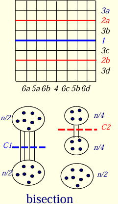

### Slice/Bisection: good for cells with high intersection on the periphery.

- horizontal lines: 1, 2, 3, 4, 5, 6, 7

- vertical lines (Bisection line):  8, 9a, 9b, 10a, 10b, 10c and 10d 

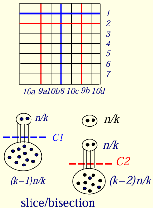

## Min-cut Placement with Terminal Propagation

Drawback of the original min-cut placement: Does not consider **the positions of terminal pins** that enter a region.

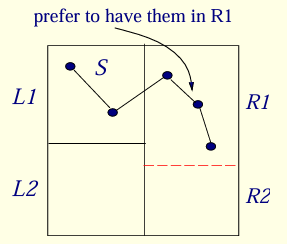

We should use the fact that $s$ in $L_1$!

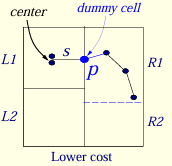

- **dummy cell** $p$

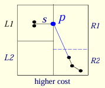

- **1/3 height** and **1/3 weight**

When not to use $p$ to bias partionting? Net $s$ has cells in many groups?

- *Don't use* $p$ to bias the solution in either direction! (The center of $s$ **loactes between 1/3 - 2/3 height**)

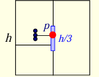

- *Use* $p$!, When center of $s$ **locates between (0 - 1/3 height) or (2/3 - 1 height)**

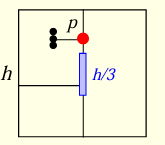

- Multiple Dummy cell $p$, minimum rectilineat Steiner tree

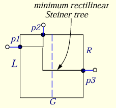

### Terminal Propagation Example

*Partitioning must be done breadth-first, not depth-first*

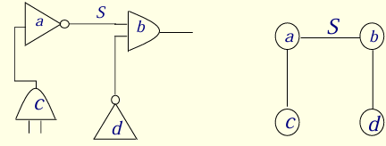

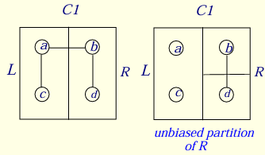

Use dummy cell $p1$

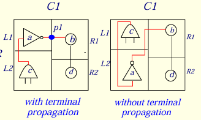

### Recursive Bisection

Start with vertical cut

**Cut 1**

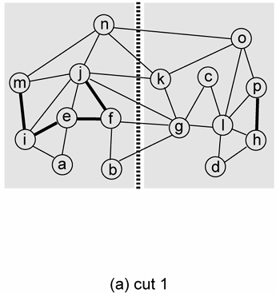


**Cut 2**

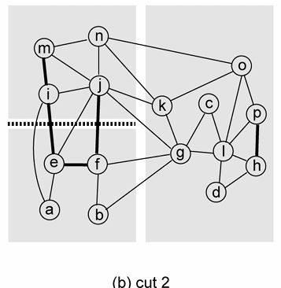

**Cut 3**

Now *terminal propagation occurs*

- Two terminals are propagated ($p1$ and $p2$) and are "pulling" nodes

- Node $k$ and $o$ connect to $n$ and $j$: $p1$ **propagated** (outside window)

    - (k, p1) twice

    - (o, p1) once

    - n and j are pointed to $p1$

- Node $g$ connect to $j$, $f$ and $b$: $p2$ **propagated** (outside window)

    - (g, p2) twice

    - (g, p1) once

    - f and b are pointed to $p2$

- Terminal $p1$ pulls $k, o, g$ to top partition, and $p2$ puuls $g$ to bottom

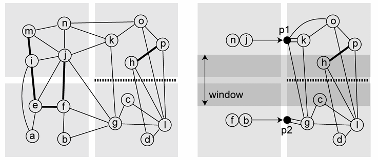

**Cut 4**

*One terminal propagated*

- Node $n$ and $j$ connect to $o$, $k$ and $g$: $p1$ **propagated**

    - (n, p1) twice

    - (j, p1) twice

    - o, k and g are pointed to $p1$

- Node $i$ and $j$ connect to $e$, $f$, $a$: **No propagation** (inside winodw (1/3 - 2/3 weight))

    - **Still put a, e, and f at the bottom left**

- Terminal $p1$ pulls $n$ and $j$ to right partition

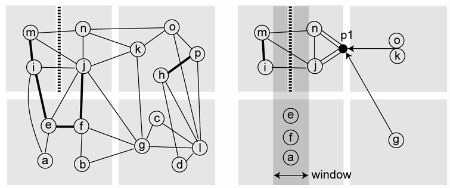

**Cut 5 to 15**

16 partitions generated by 15 cuts

- HPBB wirlength = 23

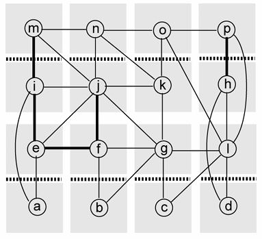

### Comparison

Quadrature vs. recursive bisection + terminal propagation

- Number of cuts: 6 vs 15

- Wirelength: 27 vs 23

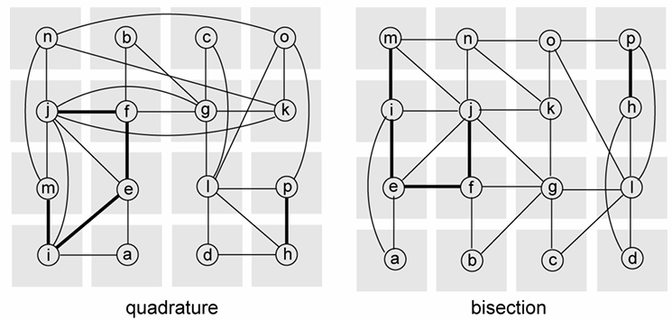

## Remarks on Min-cut Placement

Also can be implemented with **FM partitioning** method

- **Much faster** but solutions appeared to be **not as good as KL**

Use **simulated annealing** to do partitioning

- **Much slower**. If restricted to a reasonable CPU time, solutions are similar quality of those by FM method. Easy to implement.

Seeking an elegant way to force some cells to be in particular positions

Investigate other algorithms for terminal propagation

- **Terminal propagation is the bottleneck of CPU time**

# Gordian Placement (An analysis way)

## Quadratice Programming (QP)

Definition:

- Process of Solving optimization problems involving quadractic functions

- One seeks to optimize (minimize or maximize) a *multivariate quadratic function subject to linear constraints* on the variables

QP with **n variables** and **m constraints**

$$ \text{minimize } \frac{1}{2} \mathbf{x}^T \mathbf{Q} \mathbf{x} + \mathbf{c}^T \mathbf{x} $$


$$\text{subject to } \mathbf{A} \mathbf{x} \le \mathbf{b}$$

$$\mathbf{x}: n \times 1 \text{ variables vector}$$

$$\mathbf{Q}: n \times n \text{ real symmetric matrix}$$

$$\mathbf{c}: n \times 1 \text{ vector}$$

$$\mathbf{A}: m \times n \text{ real matrix}$$

$$\mathbf{b}: m \times 1 \text{ real vector}$$

## Types of QP

Depends on Q

- Positive Definite Hessian Matrix (Bowl)

    - All its eigenvalues are positive

    - One optimal value: Convex

- Semi-definite Hessian Matrix (Trough)

    - All its eigenvalues are non-negative

    - Line of optimal values: Convex

- Indefinite Hessian Matrix (Saddle)

    - Optimal is on the boundaries: Non-convex

    - NP hard

## Overview of Gordian Package

```
l := 1;
global-optimize(l);
while (there exists |Ml| > k)
    for each r in R(l)
        partition(r, r', r'');
    l++;
    setup-constraints(l);
    gloabl-optimize(l);
    repartition(l);
final-placement(l);
endprocedure
```

## Problem Definition

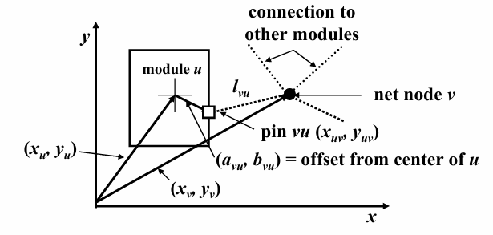

**module center** $u$

- ($x_u$, $y_u$)

**Pin** $uv$

- ($x_{uv}$, $y_{uv}$)

**Net node** $v$

- ($x_v$, $x_v$)

**Squared wire length of net** $v$ (the length from **Net** $v$ **to Pin** $uv$)

$$L_v = \sum_{u ∈ M_v} [(x_{uv} - x_v)^2 + (y_{uv} - y_v)^2]$$

**Offset between module center** $u$ and **Pin** $v$

- ($a_{vu}$, $b_{vu}$)

$$x_{uv} = x_{u} + a_{vu}$$

$$y_{uv} = y_{u} + b_{vu}$$

## Cost Function

Minimize the following:

$$\phi = \frac{1}{2}\sum_{v ∈ N} L_v W_v$$

$$\phi(x, y) = X^TCX + d_x^TX + Y^TCY + d_y^TY$$

$$\phi(x) = X^TCX + d^TX$$

## Constraints

The center of gravity constraints

- At level $l$, chip is divied into $q(\le 2^l)$ regions

- For region $p$, the center coordinates: ($u_p$, $v_p$)

- $M_p$: set of modules in region $p$

- Martix from for all regions

$$\sum_{m ∈ M_p} F_m x_m = u_p \times \sum_{m ∈ M_p} F_m$$

, where $u_p = \frac{\sum_{m ∈ M_p} F_m x_m}{\sum_{m ∈ M_p} F_m}$ 

$F_m$ is the module area

- Lastly

$$A^lX = u^l$$

, where $$a_{pm} = \frac{F_m}{\sum_{m ∈ M_p} F_m} \text{ if } m ∈ M_p \text{ otherwise } 0$$

## Problem Fomulation Example

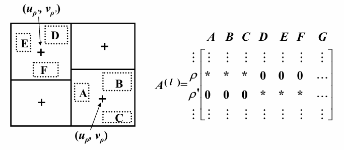

$A^l \text{ is the constraint matrix at iteration } l$

In the ($u_p$, $v_p$) center of region, there are modules A, B and C in its room, so * means the non-zero value, and other modules are all zero.

Specially,

$$A_{pm} = \frac{F_M^A}{F_M^A + F_M^B + F_M^C}$$


$$B_{pm} = \frac{F_M^B}{F_M^A + F_M^B + F_M^C}$$


$$C_{pm} = \frac{F_M^C}{F_M^A + F_M^B + F_M^C}$$

otherwise, all are zero

If there are $m$ regions at iteration $l$ and $n$ modules, the matrix $A^l$ will $m \times n$

**Linearly constrained Quadratic Programming problem**

**LQP:**

$$\text{min}_{x ∈ R^m}{\Phi(x) = X^TCX + d^TX}$$

**so that**

$$A^lX = u^l$$

## Partitioning

Recursive partitioning is needed

- to resolve module overlap in global placement

- global placement problem will be solved again with two additional center of gravity constraints

### module update (split)
$$M_p → (M_{p'}, M_{p''})$$

### module balance

$$x_{u'} \le x_{u''}, u' ∈ M_{p'} \text{ and } u'' ∈ M_{p''}$$

### Cut ratio

$$\alpha = \frac{\sum_{u' ∈ M_{p'}} F_u}{\sum_{u ∈ M_{p}} F_u} ≈ 0.5$$

### Cut value

$$C_p(\alpha) = \sum_{v ∈ N_c} W_v$$

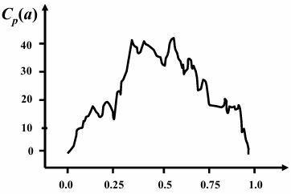

## Repartitioning

Module exchange after each cut to improve cut size

- Terminal propagation using global placement positions

Reparitioning

- to 'undo' the mistake made at the previous level

```
Procedure repartition(l)
    if overlap exits
        for each r in R(l-1)
            merge-regions(r, r', r'');
            parition(r, r', r'');
        setup-constraints(l);
        global-optimize(l);
    endif
```

## Summary of Gordian

- Global Optimization

    - Minimize wire length

    - Module coordinates

    - Position constraints

- Partitioning

    - Module set and dissection of placement region

    - Regions $\le k$ modules 

    - Module constraints

- Final Placement

    - Adoption of style dependent and constraints

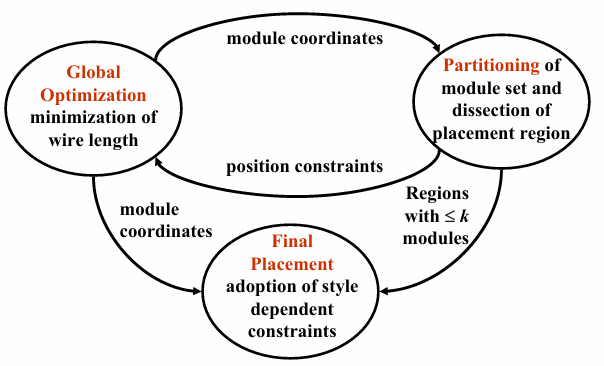

### Complexity

- Space = $O(m)$

- time = $O(m^{1.5} log_2m)$

### Final Placement

- standard cell

- macro-cell & SOG

## Gordian Placement Example

KL uses: 

Uniform area and net weight, area balance factor, $\frac{1}{k - 1}$

**But Gordian uses**:

**Undirected graph model**: each edge in **k-clique gets weight** $\frac{2}{k}$

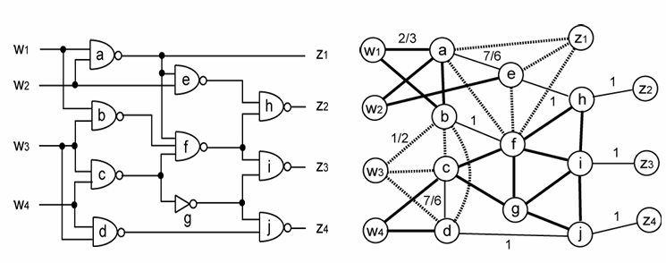

### IO Placement

**Fistly, IO Placement of chip is necessary for GORDIAN to work**

- w1(0,1), w2(0,2), w3(0,3), w4(1,4)

- z1(2,0), z2(3,0), z3(4,1), z4(4,2)

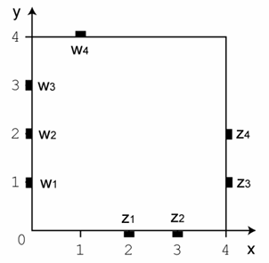

### Adjacent Matrix (A)

**Connections among movable nodes**

- Among nodes $a$ to $j$

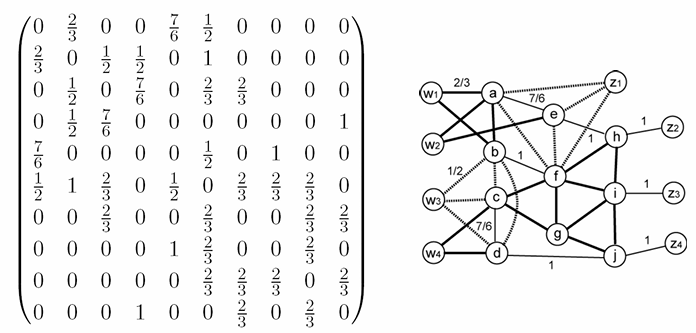

### Pin Connection Matrix (P)

**Connections between movable nodes and IO**

- Rows = movable nodes

- Columns = IO (fixed)

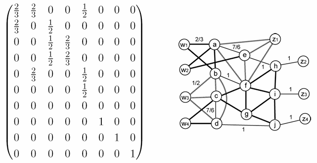

### Degree Matrix (D)

**Sum of entries based on adjacency and pin connection matrices (node degree)**

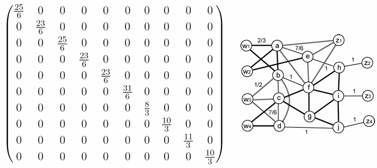

### Laplace Matrix (C)

**D - A (Degree Matrix minus Adjacent Matrix)**

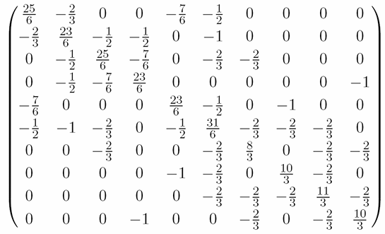

**The Laplacian Matrix is just the Matrix C**

### Fixed Pin Vectors

Based on pin connection matrix and IO location

Each entry $i$ in $d_x$, denoted $d_{x,i}$ is computed as follows:

$$d_{x,i} = - \sum_{j}p_{ij} \times x(p_{j})$$

$$d_{y,i} = - \sum_{j}p_{ij} \times y(p_{j})$$

where $p_{ij}$ denotes the entry of **the pin connection matrix**, and $x(pj)$ is the **x-coordinate of the correponding IO pin** $j$, Y-direction is defined similarly.

$$d_{x,1} = - (\frac{2}{3} \times 0 + \frac{2}{3} \times 0 + 0 \times 0 + 0 \times 1 + \frac{1}{2} \times 2 + 0 \times 3 + 0 \times 4 + 0 \times 4) = -1$$

By examining the reamining 9 movable cells, we get

$$d_{x}^{T} = (-1, 0, -\frac{2}{3}, -\frac{2}{3}, -1, -1, 0, -3, -4, -4)$$

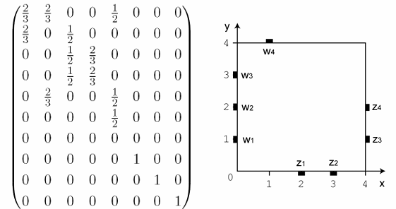

$$d_{y,1} = - (\frac{2}{3} \times 1 + \frac{2}{3} \times 2 + 0 \times 3 + 0 \times 4 + \frac{1}{2} \times 0 + 0 \times 0 + 0 \times 1 + 0 \times 2) = -2$$

By examining the reamining 9 movable cells, we get

$$d_{y}^{T} = (-2, -\frac{13}{6}, -\frac{25}{6}, -\frac{25}{6}, -\frac{4}{3}, 0, 0, 0, -1, -2)$$

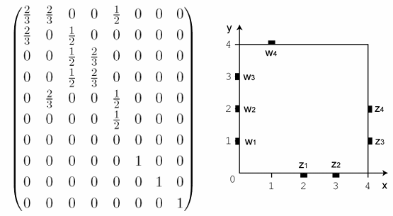

### Level 0 QP Formulation

**No constraint** necessary (since $l = 0$)

Minimize 

$$\phi(x) = \frac{1}{2}x^TCx + d_x^Tx$$

and
$$\phi(y) = \frac{1}{2}y^TCy + d_y^Ty$$

We use MOSEK and obtain the following solution:

$$x^T = \text{(0.95 0.92 1.21 1.32. 1.32 1.61 1.98 2.13 2.59 2.51)}$$

$$y^T = \text{(1.27 1.83 2.48 2.61 1.16 1.45 1.84 0.92 1.41 2.03)}$$

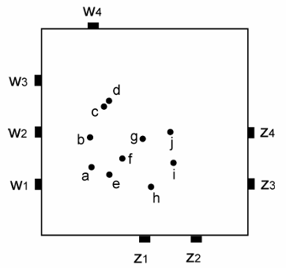

### Level 1 Partitioning

Perform level 1 partitioning

- Obatin center locations for center-of-gravity constraints

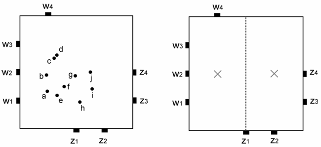

Sort the nodes based on their x - coordinates:

$$\text{\{b, a, c, e, d, f, g, h, j, i\}}$$

Paritioning under $\alpha = 0.5$:

$$S_{p'} = \text{\{b, a, c, e, d\}}, S_{p''} = \text{\{f, g, h, j, i\}}$$

The center location vectors are:

$$
u_x^{(1)} = \begin{pmatrix} 1 \\ 3 \end{pmatrix}, u_y^{(1)} = \begin{pmatrix} 2 \\ 2 \end{pmatrix}
$$

The matrix $A^{(1)}$ for the center-of-gravity constraint at level $l = 1$:

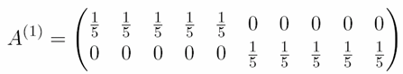

### Level 1 LQP Formulation

Solve the following Linearly constrained QP (LQP) to obtain the new placement for the movable nodes:

Minimize

$$\phi(x) = \frac{1}{2}x^TCx + d_x^Tx, \text{ subject to } A^{(1)} x = u_x^{(1)}$$


$$\phi(y) = \frac{1}{2}y^TCy + d_y^Ty, \text{ subject to } A^{(1)} y = u_y^{(1)}$$

The solutions are as follows:

$$x^T = \text{(0.70 0.71 1.17 1.21 1.22 2.17 3.10 2.84 3.56 3.33)}$$

$$y^T = \text{(1.34 1.94 2.66 2.76 1.30 1.83 2.45 1.32 1.91 2.49)}$$

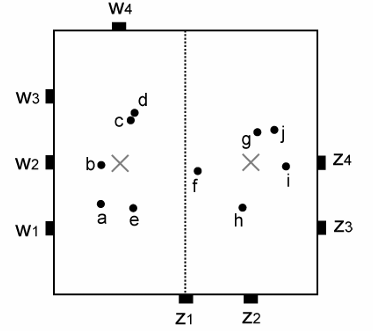

### Verification

Verify that the constraints are satified in the left partition

- a(0.70, 1.34), b(0.71, 1.94), c(1.17, 2.66), d(1.21, 2.76) and e(1.22, 1.30)

$$\frac{0.70 + 0.71 + 1.17 + 1.21 + 1.22}{5} = 1.00$$

$$\frac{1.34 + 1.94 + 2.66 + 2.76 + 1.30}{5} = 2.00$$

### Level 2 Partitioning

Add two more cut-lines

- This results in $p1 = \{c, d\}, p2 = \{a, b, e\}, p3 = \{g, j\} \text{ and } p4 = \{f, h, i\}$

- Note: **chip height is still 4 and we split 4 cells into 2:3 ratio**

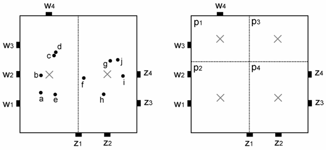

The center location vectors are:

$$
u_x^{(2)} = \begin{pmatrix} 1 \\ 1 \\ 3 \\ 3 \end{pmatrix}, \quad
u_y^{(2)} = \begin{pmatrix} 3.2 \\ 1.2 \\ 3.2 \\ 1.2 \end{pmatrix}
$$

Thus

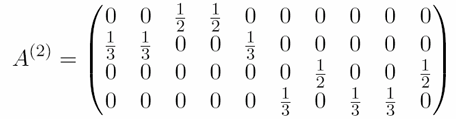

### Level 2 LQP Formulation

Solve the following Linearly constrained QP (LQP) to obtain the new placement for the movable nodes:

Minimize

$$\phi(x) = \frac{1}{2}x^TCx + d_x^Tx, \text{ subject to } A^{(2)} x = u_x^{(2)}$$


$$\phi(y) = \frac{1}{2}y^TCy + d_y^Ty, \text{ subject to } A^{(2)} y = u_y^{(2)}$$


The solutions are as follows:

$$x^T = \text{(0.83 0.78 1.00 1.00 1.39 2.28 2.89 3.06 3.66 3.11)}$$

$$y^T = \text{(1.01 1.78 3.08 3.32 0.82 1.44 3.18 0.59 1.57 3.22)}$$

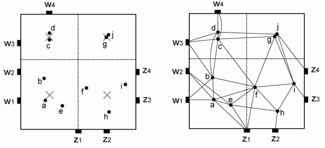

### Summary of Gordian Example

**Center-of-gravity constraint**

- Helps spread the cells evenly while monitoring wirelength

- Removes overlaps among the cells (with real dimension)

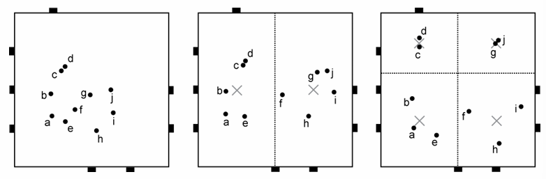

