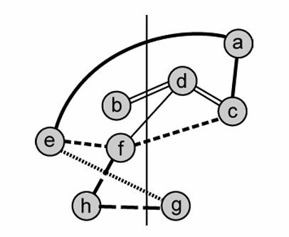
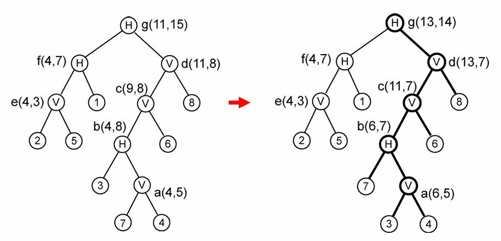

# Kernighan-Lin Algorithm

- It is a **biosectioning** algorithm
    - The input graph is partitioned into two subsets of equal sizes.

- Till the cutsize keeps improving
    - Vertex pairs which give the **largest decrease in cutsize** are exchanged.
    - These vertices are then **locked**
    - If no improvement is possible and some vertices are still unlocked, the vertices which give the smallest increase are exchanged.

- Kernighan-Lin Algorithm  
    - The formula of `gain`: 

        $$D(x, y) = g(x, y) = E_x - I_x + E_y - I_y - 2c(x, y)$$

        , where $E_x$ **is the # of extended neighbors of x**,  
        $I_x$ **is the # of interior neighbors of x**,   
        and $c(x, y)$ **is the # of mutual connected lines between x and y** 

    - **Algorithm KL**
    ```pesudocode
    begin
        INITIALIZE()
        while (IMPROVE(table) == TRUE) do (if and improvement has been made during last iteration, the process is carried out again.)
            while (UNLOCK(A) == TRUE) do (if there exists any unlocked vertex in A, more tentaive exchanges are carried out.)
                for (each a in A) do
                    if (a == unlocked) then
                        for (each b in B) then
                            if (b == unlocked) then
                                if (D_max < D(a) + D(b)) then
                                    D_max = D(a) + D(b)
                                    a_max = a
                                    b_max = b
                TENT-EXCHANGE(a_max, b_max)
                LOCK(a_max, b_max);
                LOG(table)
                D_max = negative infinite
            ACTUAL-EXCHANGE(table)
    end
    ```

- Example
    - Perform single KL pass on the following circuit:
        - KL needs **undirected graph** (**clique-based** weighting)  
            - *a single line represents a weight of 0.5*
            - *a bold line represents a weight of 1*

        

    - **First Swap (16 potential swaps)**

        

        |   pair    |   $\boldsymbol{E_x - I_x}$    |   $\boldsymbol{E_y - I_y}$    |   $\boldsymbol{c(x,y)}$   |   gain    |
        |-----------|-------------------------------|-------------------------------|---------------------------|-----------|
        |   (a, c)  |   0.5 - 0.5                   |    2.5 - 0.5                  |   0.5                     |   1       |
        |   (a, f)  |   0.5 - 0.5                   |    1.5 - 1.5                  |   0                       |   0       |
        |   (a, g)  |   0.5 - 0.5                   |    1 - 1                      |   0                       |   0       |
        |   (a, h)  |   0.5 - 0.5                   |    0 - 1                      |   0                       |   -1      |
        |   (b, c)  |   0.5 - 0.5                   |    2.5 - 0.5                  |   0.5                     |   1       |
        |   (b, f)  |   0.5 - 0.5                   |    1.5 - 1.5                  |   0                       |   0       |
        |   (b, g)  |   0.5 - 0.5                   |    1 - 1                      |   0                       |   0       |
        |   (b, h)  |   0.5 - 0.5                   |    0 - 1                      |   0                       |   -1      |
        |   **(d, c)**  |   **1.5 - 0.5**                   |   **2.5 - 0.5**                  |   **0.5**                     |   **2**       |
        |   (d, f)  |   1.5 - 0.5                   |    1.5 - 1.5                  |   1                       |   -1      |
        |   (d, g)  |   1.5 - 0.5                   |    1 - 1                      |   0                       |   1       |
        |   (d, h)  |   1.5 - 0.5                   |    0 - 1                      |   0                       |   0       |
        |   **(e, c)**  |   **2.5 - 0.5**                   |    **2.5 - 0.5**                  |   **1**                       |   **2**       |
        |   (e, f)  |   2.5 - 0.5                   |    1.5 - 1.5                  |   0.5                     |   1       |
        |   (e, g)  |   2.5 - 0.5                   |    1 - 1                      |   1                       |   0       |
        |   (e, h)  |   2.5 - 0.5                   |    0 - 1                      |   0                       |   1       |


        Select **(d,c)** pair as next swap

    - **Second Swap (9 potential swaps)**

        
   
        |   pair    |   $\boldsymbol{E_x - I_x}$    |   $\boldsymbol{E_y - I_y}$    |   $\boldsymbol{c(x,y)}$   |   gain    |
        |-----------|-------------------------------|-------------------------------|---------------------------|-----------|
        |   (a, f)  |   0 - 1                       |   1 - 2                       |   0                       |   -2      |
        |   (a, g)  |   0 - 1                       |   1 - 1                       |   0                       |   -1      |
        |   (a, h)  |   0 - 1                       |   0 - 1                       |   0                       |   -2      |
        |   (b, f)  |   0.5 - 0.5                   |   1 - 2                       |   0                       |   -1      |
        | **(b, g)** | **0.5 - 0.5** | **1 - 1** | **0**     | **0** |
        | (b, h)    |   0.5 - 0.5                   |   0 - 1                       |   0                       |   -1      |
        | (e, f)    |   1.5 - 1.5                   |   1 - 2                       |   0.5                     |   -2      |
        | (e, g)    |   1.5 - 1.5                   |   1 - 1                       |   1                       |   -2      |
        | (e, h)    |   1.5 - 1.5                   |   0 - 1                       |   0                       |   -1      |

        Select **(b, g)** pair as next swap

    - **Third Swap (4 potential swaps)**

        

        |   pair    |   $\boldsymbol{E_x - I_x}$    |   $\boldsymbol{E_y - I_y}$    |   $\boldsymbol{c(x,y)}$   |   gain    |
        |-----------|-------------------------------|-------------------------------|---------------------------|-----------|
        | **(a, f)** | **0 - 1**                    | **1.5 - 1.5**                 |   **0**                   |   **-1**  |
        | (a, h)    |   0 - 1                       |   0.5 - 0.5                   |   0                       |   -1      |
        | (e, f)    |   0.5 - 2.5                   |   1.5 - 1.5                   |   0.5                     |   -3      |
        | (e, h)    |   0.5 - 2.5                   |   0.5 - 0.5                   |   0                       |   -2      |

    Select **(a, f)** pair as next swap

    - **Fourth Swap (The last swap)**

        |   pair    |   $\boldsymbol{E_x - I_x}$    |   $\boldsymbol{E_y - I_y}$    |   $\boldsymbol{c(x,y)}$   |   gain    |
        |-----------|-------------------------------|-------------------------------|---------------------------|-----------|
        |   (e, h)  |   0.5 - 2.5                   |   1 - 0                       |   0                       |   -1      |

    - The last swap always executes.

        

    - Summary
        - **Cutsize Reduced from 5 to 3**
        - Two best solutions found (solutions are always **area-balanced**)
        - Cutsize: Take look at those images
            - The original Cutsize, look at the image of initial partitioning, and you can found 0.5 + 0.5 + 0.5 + 1 + 1 + 0.5 + 1 = 5 edges
            - Cutsize of 1st iteration looks at the second swap's image, and you can found it cuts 0.5 + 0.5 + 0.5 + 0.5 + 1 = 3 edges
            - Cutsize of 2 iteration looks at the third swap's image, and you can found it cuts 0.5 + 0.5 + 0.5 + 0.5 + 0.5 + 0.5 = 3 edges
            - Cutsize of 3 iteration looks at the last swap's (a), and you can found it cuts 1 + 0.5 + 0.5 + 0.5 + 0.5 + 0.5 + 0.5 = 4 edges
            - Custize of 4 iteration looks at the last swap's (b), and you can found it cuts 1 + 0.5 + 1 + 0.5 + 0.5 + 0.5 + 1 = 5 edges
        - $\Sigma gain(i) = Cutsize_0 - Cutsize_i$ 
        - gain(i) is the select pair's gain.


        | $\boldsymbol{i}$   |  pair     |  gain(i)   | $\Sigma$ gain(i)   | Cutsize |
        |--------------------|-----------|------------|--------------------|---------|
        |   0                | -         | -          | -                  | 5       |
        |   **1**            | **(d, c)** | **2**     | **2**              | **3**   |
        |   **2**            | **(b, g)** | **0**     | **2**              | **3**   |
        |   3                | (a, f)    | -1         | 1                  | 4       |
        |   4                | (e, h)    | -1         | 0                  | 5       |

    
- Drawbacks of K-L Algorithm
    - considers balanced partitions only
    - As vertices have unit weights, it is not possible to allocate a vertex to a partition
    - considers edges instead of hyperedges
    - High time complexity $O(n^3)$    
    
    
# Fiduccia-Mattheyses Algorithm

- A modified version of Kernighan-Lin Algorithm

- A single vertex is moved across the cut in a single move which **permits handling of unbalanced partitions**

- The concept of cutsize is extended to **hypergraphs**
    - The updated **gain** :
    
        $$\text{gain(x)} = \text{good hyperedges} - \text{bad hyperedges}$$
    
        , where $\text{good hyperedges}: \text{ total number of hyperedges that contain x as the only gate at the other side}$

        $\text{bad hyperedges}: \text{ total number uncut hyperedges that contain x}$

    - **neighbour**: All gates that are contained in the hypergraphs taht contain x

    - The time complexity of calculating a gain for a given vertice is $O(1)$

    - The time complexity of finding the neighhours for a given vertice is also $O(1)$

- Vertices to be moved are selected in a way (**bucket list**) to improve time complexity
    - **bucket lists (priority queues)**
        - Sort nodes by gain within each partition

    

- Overall time complexity of the algorithm is $O(n^2)$

- Pesudocode
    ```
    Input: 
    - G(V, E): Hypergraph with vertices V and hyperedges E
    - P1, P2: Initial partition of V such that |P1| ≈ |P2|
    - Max_imbalance: Allowed imbalance between partitions

    Output:
    - Improved partition (P1', P2') with minimized edge cut

    Initialize iteration variables:
    - Best_cutsize = Current cutsize
    - Best_move_sequence = []
    - Current_cutsize = Current cutsize
    - Moved_nodes = []
    - create a new bucket list
    - compute gain for each node and put them into bucket list

    Begin
    while there exists unlocked node in the bucket list:
        i. select the highest gain node from non-empty bucket list 
            - ensure the selected node will not exceed allowed imbalance between two partitions
        ii. move the selected node to the other partition
        iii. lock the moved node
        iv. update cutsize and track changes
            - Update Current_cutsize
            - Append move to Moved_nodes
        v. update gain of affected neigbours
            - Recompute gains for adjacent nodes
            - Move them in the bucket list accordingly
        vi. if Current_cutsize < Best_cutsize:
            - Store `Best_cutsize`
            - Store `Best_move_sequence`
    End
    ```

- Example
    - Perform FM algorithm on the following circuit:
        - Area constraint = [3, 5]
            - The maximum imbalance between two sides cannot exceed 2

        - Break ties in alphabetical order

        - Example circuit and the hypergraphs

        
    
    - Random initial partioning is gaiven
        - {a, c, d, g} and {b, e, f, h}

        - Six hyperedges
            - n1: (a, c, e)
            - n2: (b, c, d)
            - n3: (c, f, e)
            - n4: (g, f, h)
            - n5: (d, f)
            - n6: (g, e)

        

    - **Initial Bucket**
        
        |  Vertice     |  good hyperedge     |   bad hyperedge    |   gain    |
        |--------------|---------------------|--------------------|-----------|
        |   a          |    0                |     0              |   0       |
        |   b          |    1                |     0              |   1       |
        |   c          |    1                |     0              |   1       |
        |   d          |    1                |     0              |   1       |
        |   **e**      |    **2**            |     **0**          |   **2**   |
        |   f          |    1                |     0              |   1       |
        |   **g**      |    **2**            |     **0**          |   **2**   |
        |   h          |    0                |      0             |   0       |

        

        - Cutsize: 6

    - **First Move**
        - both cell *e* and *g* have the maximum gain and can be **moved without violating the area constraint**
        
        - Move **e** based on alphabetical order

        - Lock cell **e**
        
        - The neighbour of e is {a, c, f, g}

        - Update the neighbour of c and get the updated bucket list

        |  Vertice     |   good hyperedge    |  bad hyperedge     |   gain   |
        |--------------|---------------------|--------------------|----------|
        |  *a*         |   *0*               |  *1*               |   *-1*   |
        |   b          |    1                |  0                 |   1      |
        |  *c*         |   *0*               |  *1*               |   *-1*   |
        |   d          |    1                |  0                 |   1      |
        |  ***f***     |   ***2***           |  ***0***           |   ***2***|
        |  *g*         |   *1*               |  *1*               |   *0*    |
        |   h          |    0                |   0                |   0      |

        

        - Cutsize: 4

    - **Second Move**
        - cell *f* has the maximum gain but **move it will lead imbalance to exceed the area constraint**
        
        - Move **d** because it has the second maximum gain

        - Lock cell **d**

        - The neighbour of d is {b, c, f}

        - Update the neighbour of d and get the updated bucket list

        |  Vertice     |   good hyperedge    |  bad hyperedge     |   gain   |
        |--------------|---------------------|--------------------|----------|
        |  a           |   0                 |  1                 |   -1     |
        |   ***b***    |    ***0***          |  ***0***           |   ***0***|
        |   ***c***    |    ***1***          |  ***1***           |   ***0***|
        |   ***f***    |    ***1***          |  ***1***           |   ***0***|
        |  **g**       |   **1**             |  **1**             |   **0**  |
        |  **h**       |   **0**             |  **0**             |   **0**  |

        

        - Cutsize: 3

    - **Third Move**
        - cell *b*, *c*, *f*, *g*, *h* have the maximum gain

        - Move **b** as **move it without violating the area constraint** and on the alphabetical order

        - Lock cell **b**

        - The neighbour of b is {c} (cell d has been locked)

        - Update the neighbor of b and get the updated bucket list 

        |  Vertice     |   good hyperedge    |  bad hyperedge     |   gain   |
        |--------------|---------------------|--------------------|----------|
        |  a           |   0                 |  1                 |   -1     |
        |   *c*        |    *0*              |  *1*               |   *-1*   |
        |  **f**       |   **1**             |  **1**             |   **0**  |
        |  **g**       |   **1**             |  **1**             |   **0**  |
        |  **h**       |   **0**             |  **0**             |   **0**  |

        

        - Cutsize: 3

    - **Forth Move**
        - cell *f*, *g*, *h* have the maximum gain

        - Move **g** as **move it withut violating the area constraint** and on the alphabetical order

        - Lock cell **g**

        - The neighbour of g is {f, h} (cell e has been locked)

        - Update the neighbor of g and get the updated bucket list

        |  Vertice     |   good hyperedge    |  bad hyperedge     |   gain   |
        |--------------|---------------------|--------------------|----------|
        |  ***a***     |   ***0***           |  ***1***           |  ***-1***|
        |  ***c***     |   ***0***           |  ***1***           |  ***-1***|
        |  ***f***     |   ***1***           |  ***2***           |  ***-1***|
        |  ***h***     |   ***0***           |  ***1***           |  ***-1***|

        

        - Cutsize: 3

    - **Fifth Move**
        - cell *a*, *c*, *f*, *h* have the maximum gain

        - Move **a** on the alphabetical order

        - Lock cell **a**

        - The neighbour of a is {c} (cell e has been locked)

        - Update the neigbour of a and get the updated bucket list

        |  Vertice     |   good hyperedge    |  bad hyperedge     |   gain   |
        |--------------|---------------------|--------------------|----------|
        |  ***c***     |   ***0***           |  ***0***           |  ***0*** |
        |  f           |   1                 |  2                 |  -1      |
        |  h           |   0                 |  1                 |  -1      |

        

        - Cutsize: 4

    - **Sixth Move**
        - cell *c* has the maxiumum gain but **moving c will violates the area constraint**

        - Move **f** on the alphabetical order

        - Lock cell **f**

        - The neighbour of f is {c, h} (cell c, d and g have been locked)

        - Update the neighbour of f and get the updated bucket list

        |  Vertice     |   good hyperedge    |  bad hyperedge     |   gain   |
        |--------------|---------------------|--------------------|----------|
        |  *c*         |   *0*               |  *1*               |  *-1*    |
        |  ***h***     |   ***0***           |  ***0***           |  ***0*** |

        

        - Cutsize: 5

    - **Seventh Move**
        - cell *h* has the maximum gain and move without violating the area constraint

        - Move **h**

        - Lock cell **h**

        - **h has no neigbhour** and the bucket list will be

        |  Vertice     |   good hyperedge    |  bad hyperedge     |   gain   |
        |--------------|---------------------|--------------------|----------|
        |  c           |   0                 |  1                 |  -1      |
        
        

        - Cutsize: 5

    - **Last Move**
        - can only move cell **c**

        

        - Custzie: 6

    - **Summary**
        - Found three best solutions

        - Solutions after moving 2 and 4 are better balanced

        |   i   |   cell    |   g(i)    |   $\sum g(i)$ |   cutsize |
        |-------|-----------|-----------|---------------|-----------|
        |   0   |   -       |   -       |   -           |   6       |
        |   1   |   e       |   2       |   2           |   4       |
        | **2** |   **d**   |   **1**   |   **3**       |   **3**   |
        | **3** |   **b**   |   **0**   |   **3**       |   **3**   |
        | **4** |   **g**   |   **0**   |   **3**       |   **3**   |
        |   5   |   a       |   -1      |   2           |   4       |
        |   6   |   f       |   -1      |   1           |   5       |
        |   7   |   h       |   0       |   1           |   5       |
        |   8   |   c       |   -1      |   0           |   6       |

        - when i = 2 and i = 4, the two sides both have 4 cells, while i = 3, one side has 3 cells and another side has 5 cells.
            - {a, c, e, g} and {b, d, f, h}, {a, b, c, e} and {d, f, h, g} are more balanced than {a, b, c, e, g} and {f, g, h}


# Polish Expression

Partitioning leads to 

- Blocks with well-defined **areas and shapes** (it may also need *clustering* to combine several partitions into one single partition.)

- Blocks with approximated areas and no particular shapes (flexible blocks)

- A **netlist** specifying connections between the blocks.

Floorplanning, Placement, and Pin Assignment

- Find **locations** for all blocks

- Consider shapes of flexible block, pin locations of all the blocks.

- Three steps in the physical design for VLSI systems 
    - Partitioning
    - Floorplanning
    - Routing


Floor planning

- Inputs to the floorplanning problem:
    - A set of blocks, fixed or flexible
    - Pin locations of fixed blocks
    - A netlist

- Objective: 
    - **Minimize Area**
    - **Reduce wirelength** for (critical) nets
    - **Maximize routability**
    - determine shapes of flexible blocks

Some terminologies for Floorplan Design

- Modules: a shape of rectangle with a width of x and a height of y.

- Aread: the area of the module, i.e, xy

- Aspect ratio: the allowed minimum and maximum value of height and weight ratio (r <= y/x <= s>)

- Rotation: the rotated module with a width of y and a height of x

- Module connectivity: the distances between the centers of modules

- **Rectangular dissection**: subdivison of a given rectangle by a finite number of horizontal and vertical line segments into a finite number of non-overlapping rectangles.

- **Slicing struture**: a rectangular dissection that can be obtained by repetitively subdividing rectangles horizontally or vertically.

- **Slicing tree**: A binary tree, where each internal node represents a vertical cut line or horizontal cut line, and each leaf a basic rectangle.

- **Skewed Slicing tree**: One in which and its **right** child are the same.


- A good structure should be a **slicing floorplan** and **skewed slicing tree**

## Polish Expression Representation

An expression $E = e_1e_2...e_{2n-1}$ where $e_i \in {1, 2, ..., n, H, V}$, $1 \le i \le 2n-1$, is a Polish expression of length of 2n - 1 iff:

**1. every operand j**, $1 \le j \le n$, **appears exactly once in E.** 

**2. The balloting property**:

For every subexpression $E_i = e_1...e_i, 1 \le i \le 2n-1$, $$\text{number of operands} > \text{number of operators}$$

|                   |   1   |   6   |   H   |   3   |   5   |   V   |   2   |   H   |   V   |   7   |   4   |   H   |   V   |
|-------------------|-------|-------|-------|-------|-------|-------|-------|-------|-------|-------|-------|-------|-------|
|number of operands |   1   |   2   |   2   |   3   |   4   |   4   |   5   |   5   |   5   |   6   |   7   |   7   |   7   |
|number of operators|   0   |   0   |   1   |   1   |   1   |   2   |   2   |   3   |   4   |   4   |   4   |   5   |   6   |

- Polish expression: acutally is a **Postorder Traversal**

- Define: 
    - *ijH*: module $i$ on bottom of $j$.
    ```
        H              module j
       / \      ->    -----------
      i   j            module i
    ```
    - *ijV*: module $i$ on left of $j$.
     ```
        V              
       / \      ->     module i | module j
      i   j            
    ```

- exmaple:


- Some tips for creating skewed tree from slicing footplan:

    - Slice vertically first the slice horizontally if two operators are equivalent

    - For continous horizontal slicing, slicing from bottom to up.

    - For continous vertical slicing, slicing from left to right.

    - Once happen non-skewed tree in the represnetation, use right-branch rotation method:
        
        i.  the right leaf of the original lower right leaf become the original lower right node.

        ii. the left leaf of the original lower right become the original lower right node's right leaf
        
        iii. the left leaf of original upper node becomes the left leaf of original lower right node
        
        iv. the original lower right node becomes left node of original upper node.

        ```
                      V                                             V
                   /     \                                      /       \
                  H        H                                   H         H
                 / \     /   \                                / \      /   \
                2   1   V     H             ->               2   1    H      3
                       / \   / \                                    /   \
                      6   7 V   3                                  V     V   
                           / \                                    / \   / \
                          4   5                                  6   7 4   5
        ```

## Normalized Polish Expression

A Polish expression E = e_1e_2...e_{2n-1} is called normalized iff **E has no consecutive operators of the same type (H or V)**.

Theory: Given a **normalized** Polish expression, we can construct a unique rectangular angular slicing three.

- examole:


## Three types Moves of Polish Expression

|Pollsion Expression|   1   |   6   |   H   |   3   |   5   |   V   |   2   |   H   |   V   |   7   |   4   |   H   |   V   |
|-------------------|-------|-------|-------|-------|-------|-------|-------|-------|-------|-------|-------|-------|-------|
|number of operands |   1   |   2   |   2   |   3   |   4   |   4   |   5   |   5   |   5   |   6   |   7   |   7   |   7   |
|number of operators|   0   |   0   |   1   |   1   |   1   |   2   |   2   |   3   |   4   |   4   |   4   |   5   |   6   |

- **Chain**
    - HVHVH... or
    - VHVHV...
    - The third and forth chain is a *HV* two-operator chain while the first and second chain is a one-operator chain.

- **Adjacent**
    - 1 and 6 are adjacent operands
    - 2 and 7 are adjacent operands as well
    - 5 and V are adjacent operand and operator

### M1 (Opreand Swap):
Swap two **adjacent oprands**

### M2 (Chain Invert): 

Complement some **chains** ($\overline{V} = H, \overline{H} = V$).

### M3 (Operator/Operand Swap): 

Swap **two adjacent operand and operator**.

- Pay attention to M3 movement: it may cause illegal normalzide Polish Expression.

- **Gold thrumb rule**: Move operands to the left is always valid, but move operators to the left may not be valid, need M3 checks.

- **Check M3 Moves:**  Assume that the M3 move swaps the operand $e_i$ with the operator $e_{i+1}$, $1 \le i \le k - 1$. Then, the swap will not violate the balloting property iff $$2N_{i+1} < i$$.

    - $N_k$: # of operands in the Polish expression $E = e_1e_2...e_k$, $1 \le k \le 2n - 1$

    - For example (see the table): 

        - swap 2 and H: the index of 2 is *7* and the index of H is *8*, the number of opreands at *index 7* is **5** and the number of operators at *index 8* is **3**, (i.e, $N_8 = 3$) and $2*N_8 < 7$, so this move is valid.

        - swap 6 and H: the index of 6 is *2* and the number of operators of H is **1** (i.e, $N_3 = 1$), and $2*N_3 = 2$, so this move is invalid.

    - In addition, if the move oprand and move operator is at index i and i + 1, and the operator at index i - 1 shouldn't be same with operator i + 1.

    - For example, the Polish Expression is 16H35V2VH74HV. The move of operand and operator at index 7 and index 8 is not allowed. (2V)

## Example of construction floorplan from a given normalized Polish Expression

### Initial normalized Polish Expression

PE1 = 25V1H374VH6V8VH

Dimensions: (2,4), (1,3), (3,3), (3,5), (3,2), (5,3), (1,2), (2,4)


### M1 Move

Swap module 3 and 7 in PE1 and get PE2 = 25V1H734VH6V8VH




### M2 Move

Complement last chain in PE2 will get PE3 = 25V1H734VH6V8HV


### M3 Move

Swaps 6 and V in PE3 will get PE4 = 25V1H734VHV68HV

- In PE3, the index of 6 is *11* and the number of operator of V is **5** ($N_12 = 5$)

- The swaps 6 and V are valid because $2N_12 = 10 < 11$, so swap of 6 and V is valid.


## Area Computation

- **abH**
    - $A = max(\text{width of a}, \text{width of b}) \times (\text{height of a} + \text{height of b})$

    

- **abV**
    - $A = (\text{width of a} + \text{width of b}) \times max(\text{height of a} + \text{height of b})$

    

## Over wiring length Computation

The overall wiring length is:

$$W = \sum_{ij} c_{ij} d_{ij}$$

, where $c_{ij}$ is the number of connections between blocks $i$ and $j$.

$d_{ij}$ is the center-to-center distance between basic rectangles $i$ and $j$.

## Cost Function

The cost function is:

$$\Phi = A + \lambda W$$

, where $\lambda$ is the user-specified parameter.

